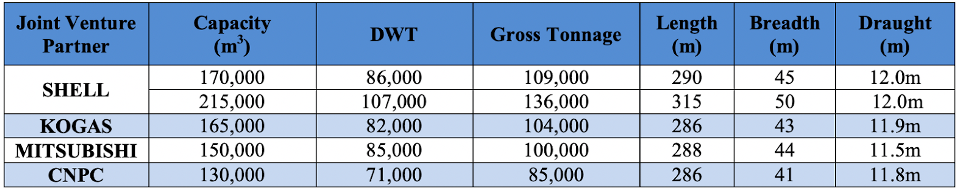
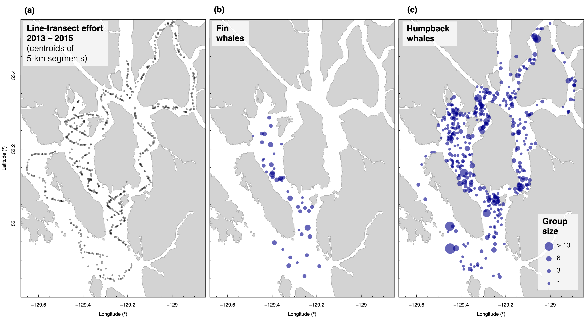
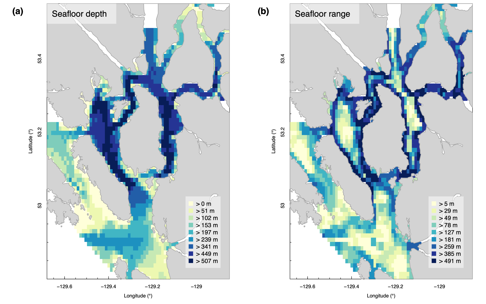

```{r setup, include=FALSE}
#knitr::opts_chunk$set(fig.pos = "!H", out.extra = "")

library(dplyr)
library(ggplot2)
library(readr)
library(knitr)
library(kableExtra)
library(bangarang)
library(ggridges)

library(devtools)
document('../../')

month_initials <- c('J','F','M','A','M','J','J','A','S','O','N','D')
```


***** 

# Marine traffic

```{r, echo=FALSE, eval=TRUE, warning = FALSE, message = FALSE, fig.height=5, fig.width = 8}
ais <- readRDS('../ais/AIS_2019_cleaned.RData')

aistab <- ais_table(ais)
aistab <- aistab %>% select(1,2,4,8:ncol(aistab))
names(aistab) <- c('Type','VIDs','Transits',
                   'mean', 'sd', 'max', 
                   'mean', 'sd', 'min', 'max', 
                   'mean', 'sd', 'min', 'max',
                   'mean', 'sd', 'min', 'max')
knitr::kable(aistab,
             booktabs = TRUE, linesep = '',
             caption = 'Table S1. Summary of 2019 marine traffic within the lower Kitimat Fjord System, as reported by archival AIS data.') %>%
  kable_styling(font=11) %>% 
   add_header_above(header=c(" " = 3, 
                            "Speed (kn)" = 3, 
                            'Length (m)' = 4,
                            'Beam (m)' = 4,
                            'Draft (m)' = 4)) %>% 
  row_spec (0, bold = T)
```

&nbsp;  

```{r, echo=FALSE, eval=FALSE, warning = FALSE, message = FALSE, fig.height=5, fig.width = 8}
# Grouped AIS vessel traffic
# Don't show this in Rmd
ais <- readRDS('../ais/AIS_2019_grouped.RData')

aistab <- ais_table(ais)
aistab <- aistab %>% select(type, vids, transits, transit_rate,
                            speed_mn:draft_max)
names(aistab) <- c('Vessel type', 'IDs','Transits', 'Transits/day',
                   'mean', 'sd', 'max', # speed
                   'mean','sd','min','max', # length
                   'mean', 'sd', 'min', 'max', # beam
                   'mean', 'sd', 'min', 'max') # draft
                   
knitr::kable(aistab,
             booktabs = TRUE, linesep = '',
             longtable = T,
             caption = 'Table 1. AIS traffic within the study area in 2019, grouped into 10 vessel classes.') %>%
  kable_styling(font=11) %>% 
  add_header_above(header=c(" " = 4, 
                            "Speed (kn)" = 3, 
                            'Length (m)' = 4,
                            'Beam (m)' = 4,
                            'Draft (m)' = 4)) %>% 
  row_spec (0, bold = T)
```

&nbsp;  

```{r, echo=FALSE, eval=TRUE, warning = FALSE, message = FALSE, fig.height=5, fig.width = 8}
# Grouped AIS vessel traffic - FW habitat only in Squally Channel
ais <- readRDS('../ais/AIS_2019_grouped.RData')

ais <- 
  ais %>% 
  filter(x >= -129.4519,
         x < -129.26239,
         y >= 53.069,
         y < 53.3218)
  
aistab <- ais_table(ais)
aistab <- aistab %>% select(type, vids, transits, transit_rate,
                            speed_mn:draft_max)
names(aistab) <- c('Vessel type', 'IDs','Transits', 'Transits/day',
                   'mean', 'sd', 'max', # speed
                   'mean','sd','min','max', # length
                   'mean', 'sd', 'min', 'max', # beam
                   'mean', 'sd', 'min', 'max') # draft

knitr::kable(aistab,
             booktabs = TRUE, linesep = '',
             longtable = T,
             caption = 'Table S2. AIS traffic in 2019, restricted to prime fin whale habitat in Squally Channel, including Lewis Passage and north Campania Sound (W 129.4519 - 129.26239, N 53.069 - 53.3218)') %>%
  kable_styling(font=10) %>% 
  add_header_above(header=c(" " = 4, 
                            "Speed (kn)" = 3, 
                            'Length (m)' = 4,
                            'Beam (m)' = 4,
                            'Draft (m)' = 4)) %>% 
  row_spec (0, bold = T)
```

&nbsp;  

```{r, echo=FALSE, eval=TRUE, warning = FALSE, message = FALSE, fig.height=4, fig.width = 8, fig.cap = 'Figure S1. Length distributions of the ten vessel classes used to summarize marine traffic in 2019.'}
ais <- readRDS('../ais/AIS_2019_grouped.RData')

ggplot(ais, aes(x=length)) +
  geom_histogram() +
  facet_wrap(~type, scales='free') +
  ylab('AIS records') +
  xlab('Reported length (m)') +
  theme(plot.caption = element_text(hjust = 0)) + 
  labs(title = 'Lengths (meters) for 2019 vessel types used in analysis')
```

&nbsp;  

```{r, echo=FALSE, eval=TRUE, warning = FALSE, message = FALSE, fig.height=4, fig.width = 8, fig.cap = 'Figure S2. Speed distributions, in knots, of the ten vessel classes used to summarize marine traffic in 2019.'}
ggplot(ais, aes(x=speed)) +
  geom_histogram() +
  facet_wrap(~type, scales='free') +
  ylab('AIS records') +
  xlab('Reported speed (knots)') +
  theme(plot.caption = element_text(hjust = 0)) + 
  labs(title = 'Speed (knots) for 2019 vessel types used in analysis')
```

&nbsp;  

```{r, echo=FALSE, eval=TRUE, warning = FALSE, message = FALSE, fig.height=4.5, fig.width = 8, fig.cap = 'Figure S3. Seasonal patterns in the speed (knots) of marine traffic, grouped iinto the 10 vessel classes used in this study.'}
data(ais_2019)

ais <-
  ais_2019 %>%
  group_by(type, month, vid) %>%
  summarize(speed = mean(speed, na.rm=TRUE))

ggplot(ais, aes(x=month, y=speed)) +
  geom_jitter(alpha=.5, width=.3) +
  facet_wrap(~type) +
  xlab('Month') + ylab('Vessel speed (kn)') + 
  theme(plot.caption = element_text(hjust = 0)) + 
  scale_x_continuous(breaks=1:12, labels=month_initials) + 
  labs(title='Seasonal patterns in speed of marine traffic (2019)')
```

&nbsp;  

```{r, echo=FALSE, eval=TRUE, warning = FALSE, message = FALSE, fig.height=4.5, fig.width = 8, fig.cap = 'Figure S4.Seasonal patterns in the length (meters) of marine traffic, grouped iinto the 10 vessel classes used in this study.'}
ais <-
  ais_2019 %>%
  group_by(type, month, vid) %>%
  summarize(length = mean(length, na.rm=TRUE)) #%>%

ggplot(ais, aes(x=month, y=length)) +
  geom_jitter(alpha=.5, width=.3) +
  facet_wrap(~type) + 
  ylab('Vessel size (m)') + xlab('Month') +
  scale_x_continuous(breaks=1:12, labels=month_initials) + 
  theme(plot.caption = element_text(hjust = 0)) + 
  labs(title='Seasonal patterns in length of marine traffic (2019)')
```

&nbsp;  

```{r, echo=FALSE, eval=TRUE, warning = FALSE, message = FALSE, fig.height=4, fig.width = 8}
ais_trends <- readRDS('../ais/vessel_trends.RData')

ais_trends <- 
  ais_trends %>% mutate(across(km_2014:km_2030, ~round(.,0)),
                      scale_factor = round(scale_factor, 2),
                      rate_2019 = round(rate_2019, 2),
                      rate_2030 = round(rate_2030, 2),
                      pvalue = round(pvalue, 2))

# Average rate of increase in 2019
#(means <- ais_trends$rate_2019[ais_trends$rate_2019>0]) %>% mean
# Percent increase in km, 2019 - 2030
#sum(ais_trends$km_2030) / sum(ais_trends$km_2019)

names(ais_trends) <- c('Vessel class', '2014', '2015', '2018', '2019', '2030', 
                       'Scale factor', '2019', '2039', 'p-value')

knitr::kable(ais_trends,
             booktabs = TRUE, linesep = '',
             longtable = T,
             caption = 'Table S3. Trends (historical and predicted) in AIS traffic, 2014 - 2030. Kilometers transited in 2014 - 2019 are observations, while the 2030 numbers are predicted based on linear models. The "scale factor" is the multiplier used, based on those models, to estimate 2030 transits based on 2019 data. "Prop. change" is the proportional rate of change in total transits. The p-value refers to the linear model for each vessel class.') %>%
  kable_styling(font=10) %>% 
  add_header_above(header=c(" " = 1, 
                            "Kilometers transited" = 5, 
                            ' ' = 1,
                            'Prop. change' = 2,
                            ' ' = 1)) %>% 
    row_spec (0, bold = T)
```

&nbsp;  

```{r, echo=FALSE, eval=TRUE, warning = FALSE, message = FALSE, fig.height=3.2, fig.width = 8, fig.cap = 'Figure S5. Changes in total transit kilometers for the 10 vessel classes in our study, 2014 - 2019.'}
ais_trends <- readRDS('../ais/vessel_trends_obs.RData')

ggplot(ais_trends, mapping=aes(x=year, y=km, color=type)) +
  geom_point(size=1.8) +
  geom_line() +
  ylab('Kilometers transited in study area') +
  xlab(NULL) +
  theme(plot.caption = element_text(hjust = 0)) + 
  labs(color='Vessel class',
       title="Trends in Gitga'at area vessel traffic, 2014 - 2019") + 
  theme_light()
```

&nbsp;  

Table S4. Dimensions of the LNG Canada fleet, adapted from TERMPOL (2015). Note that in our analyses, we reduced the max Shell length to 298m, and the beam was adjusted according to the original length:beam ratio. 
<p align="center">
{width=85%}
</p>

&nbsp;  

***** 

&nbsp;  

# Methods details

## Line-transect surveys

```{r, echo=FALSE, eval=TRUE, warning = FALSE, message = FALSE, fig.height=5, fig.width = 8}
data(segments_5km)
segments <- segments_5km
data("whale_sightings")
sightings <- whale_sightings

if(FALSE){
  head(segments)
segments$Effort %>% mean
segments$Effort %>% sum
segments$Effort[segments$Effort < 10] %>% sum
}

# Summarize effort
segtab <- 
  segments %>%
  dplyr::group_by(year) %>%
  dplyr::summarize(segments = n(),
                   km_effort = sum(Effort))

# Summarize sightings
sittab <- 
  sightings %>%
  filter(spp != 'BW') %>% 
  filter(spp != 'DP') %>% 
  dplyr::mutate(year = lubridate::year(datetime)) %>%
  dplyr::group_by(year) %>%
  dplyr::summarize(fin_tot = length(which(spp == 'FW')),
                   fin_valid = length(which(spp=='FW' & !is.na(distance))),
                   humpback_tot = length(which(spp == 'HW')),
                   humpback_valid = length(which(spp=='HW' & !is.na(distance)))) 

lta_tab <- left_join(segtab, sittab, by='year')

names(lta_tab) <- c('Year','segments', 'km', 'total', 'valid', 'total', 'valid')
knitr::kable(lta_tab,
             booktabs = TRUE, linesep = '',
             longtable = T,
             caption = 'Table S5. Effort and sighting details from line-trasect surveys within the Kitimat Fjord Surveys, 2013 - 2015. For each species, "total" counts include all detections while on systematic effort, while "valid" counts include detections with valid detection-distance estimates.') %>%
  #kable_styling(latex_options="scale_down") %>% 
kable_styling(font=10) %>% 
    add_header_above(header=c(" " = 1, 
                            "Effort" = 2, 
                            'Fin whales'=2, 
                            'Humpback whales' = 2)) %>% row_spec (0, bold = T)

```

&nbsp;  

<p align="center">
{width=100%}
</p>

Figure S6. (a) Design-based line-transect survey effort throughout the central Gitga’at waters of the Kitimat Fjord System (each dot is the center of a 5-km segment of systematic effort), yielding detections of (b) fin whales and (c) humpback whales. Detection dot size reflects group size

&nbsp;  


```{r, echo=FALSE, eval=TRUE, warning = FALSE, message = FALSE, fig.height=5, fig.width = 8}
# FW detection function models
load('../fw/ds-models.RData')
df_tab_fw <- Distance::summarize_ds_models(dso1, dso2, dso3)
df_tab_fw$Model <- 1:nrow(df_tab_fw)
df_tab_fw1 <- data.frame(Species = c('Fin whale', rep('',times=(nrow(df_tab_fw)-1))), df_tab_fw)

# HW detection function models
load('../hw/ds-models.RData')
df_tab_hw <- Distance::summarize_ds_models(dso1, dso2, dso3)
df_tab_hw$Model <- 1:nrow(df_tab_hw)
df_tab_hw1 <- data.frame(Species = c('Humpback whale', rep('',times=(nrow(df_tab_hw)-1))), df_tab_hw)

df_tab <- rbind(df_tab_fw1, df_tab_hw1)
names(df_tab) <- c('Species',names(df_tab_fw))

knitr::kable(df_tab,
             booktabs = TRUE, linesep = '',
             #longtable = T,
             caption = 'Table S6. Best-fitting models of the detection functions for fin whales and humpback whales, based upon 2013-2015 line-transect surveys.') %>%
  #kable_styling(latex_options="scale_down") %>% 
kable_styling(font=10) %>% 
    row_spec (0, bold = T)
```

&nbsp;  

```{r, echo=FALSE, eval=TRUE, warning = FALSE, message = FALSE, fig.height=3.5, fig.width = 8, fig.cap='Figure S7. Best-fitting detection function models superimposed upon histograms of detection distances for each species.'}
load('../fw/ds-models.RData')
ds_fw <- dso1

load('../hw/ds-models.RData')
ds_hw <- dso3

par(mfrow=c(1,2))
plot(ds_fw, main='Fin whales')
plot(ds_hw, main='Humpback whales')
```

&nbsp;  

<center>
{width=85%}
</center>
Figure S8. Bathymetric characteristics of the study area, as summarized for the square-kilometer grid used in density surface modeling.  

&nbsp;  

## Humpback whale UAS analysis

```{r, echo=FALSE, eval=TRUE, warning = FALSE, message = FALSE}
mr <- readRDS('../hw/hw_lengths.RData')

# Rule: at least 1 score-1 photo,
# take average of all score-1 and score-2 for mean
# (look at means for each category spearately to assess effect of photo quality)
mrs <-
  mr %>%
    filter(score < 3) %>% 
  group_by(id) %>%
  summarize(n = n(),
            n1 = length(which(score==1)),
            n2 = length(which(score==2)),
            len = mean(length, na.rm=TRUE) %>% round(2),
            len_sd = sd(length[is.finite(length)], na.rm=TRUE) %>% round(2),
            len1 = mean(length[score == 1 & is.finite(length)], na.rm=TRUE) %>% round(2),
            len2 = mean(length[score == 2 & is.finite(length)], na.rm=TRUE) %>% round(2),
            flu = mean(fluke, na.rm=TRUE) %>% round(2),
            flu_sd = sd(fluke[is.finite(fluke)], na.rm=TRUE) %>% round(2),
            flu1 = mean(fluke[score == 1 & is.finite(fluke)], na.rm=TRUE) %>% round(2),
            flu2 = mean(fluke[score == 2 & is.finite(fluke)], na.rm=TRUE) %>% round(2)) 

#mrs

# Whales measured
#mrs %>% nrow

# Length
# mrs$len %>% mean # 11.85352
# mrs$len %>% sd # 1.317888
# mrs$len %>% min # 10.41
# mrs$len %>% max # 14.45

# Fluke
# mrs$flu %>% mean # 3.907342
# mrs$flu %>% sd # 0.3420583
# mrs$flu %>% min # 3.52
# mrs$flu %>% max # 4.44

# Length:fluke ratio
# 3.907 / 11.85 

names(mrs) <- c('Whale ID', 
                'Total','Score 1', 'Score 2', 
                'Mean', 'SD', 'Score 1', 'Score 2', 
                'Mean', 'SD', 'Score 1', 'Score 2')

# Placeholder for whaleLength results
options(knitr.kable.NA = '')
knitr::kable(mrs,
             booktabs = TRUE, 
             linesep = '',
             caption = "Table S7. Humpback whale morphometrics (n=13 individuals) measured by UAS in Gitga'at waters in 2019.") %>%
  kable_styling(font=10) %>% 
  add_header_above(header=c(" " = 1, 
                            "Measurements" = 3, 
                            'Body length (m)'=4,
                            'Fluke width (m)' = 4)) %>% 
  row_spec (0, bold = T)
```

```{r, echo=FALSE, eval=TRUE, warning = FALSE, message = FALSE}
lidar <- readRDS('../hw/uas/hw_lidar_results.RData')
lidar$duration_mean <- round(lidar$duration_mean, 2)
lidar$km_mean <- round(lidar$km_mean, 2)
lidar$duration_sum <- round(lidar$duration_sum, 2)
lidar$km_sum <- round(lidar$km_sum, 2)
lidar$mps <- round(lidar$mps, 3)

names(lidar) <- c('Date', 'File', 'Follows', 'Mean','Total', 'Mean', 'Total', 'Speed (m/s)')

knitr::kable(lidar,
             booktabs = TRUE, linesep = '',
             #longtable = T,
             caption = 'Table S8. Summary of UAS flights used to estimate humpback whale swimming speed. Multiple follows of the same group were averaged together before calculating speed.') %>%
  kable_styling(font=11) %>% 
  add_header_above(header=c(" " = 3, 
                            "Duration (sec)" = 2, 
                            'Distance (km)'=2,
                            ' '=1)) %>% 
  row_spec (0, bold = T)
```


## Fin whale dive tag analysis 

```{r, echo=FALSE, eval=TRUE, warning = FALSE, message = FALSE, fig.height=4.5, fig.width = 8, fig.cap = 'Figure S9. Raw time- and depth-distributions of depth sensor readings for each of the 7 SPLASH-10 tag deployments.'}
df <- readRDS('../psurface/tag_data.RData')

ggplot(df, aes(x=datetime, y=z)) +
  geom_point(alpha=.5, size=.5) +
  ylim(220, 0) +
  ylab('Tag depth (m)') +
  xlab(NULL) +
  facet_wrap(~id, scales='free') +
  theme_light() + 
  theme(plot.caption = element_text(hjust = 0)) + 
  labs(title='Raw tag data')
```

&nbsp;  

```{r, echo=FALSE, eval=TRUE, warning = FALSE, message = FALSE, fig.height=4.5, fig.width = 8, fig.cap = 'Figure S10. Time distribution (hour of day, color-coded by daytime/nighttime) of depth samples from SPLASH10 tags, displayed for each deployment separately.'}
ggplot(df, aes(x=hour, y=z, color=diel)) +
  geom_point(alpha=.5) +
  ylim(220, 0) +
  xlab('Hour of day (UTC)') +
  ylab('Tag depth (m)') +
  facet_wrap(~id) +
  labs(color='Diel period') +
  theme_light() + 
  theme(plot.caption = element_text(hjust = 0)) + 
  labs(title='Tag data by time of day') 
```

&nbsp;  

```{r, echo=FALSE, eval=TRUE, warning = FALSE, message = FALSE}
# Summarize tag dataset
id_summary <-
  df %>%
  group_by(id, deploy_ptt) %>%
  summarize(start = min(datetime),
            stop = max(datetime),
            span = as.numeric(difftime(max(datetime), min(datetime), units='hours')),
            hours = (75*n()/3600),
            n = n(),
            n_day = length(which(diel == 'day')),
            n_night = length(which(diel == 'night'))) %>% 
  mutate(frac_valid = round(hours / span, 2))

names(id_summary) <- c('This study', 'Nichol et al. (2018)', 'Start', 'Stop', 'Hours', 'Hours valid', 'Total', 'Day', 'Night', 'Prop. valid')

# Produce table
knitr::kable(id_summary,
             booktabs = TRUE, linesep = '',
             #longtable = T,
             caption = 'Table S9. Summary of SPLASH10 depth data used in fin whale depth distribution analysis.') %>%
  kable_styling(font=10) %>% 
add_header_above(header=c("Deployment ID" = 2, 
                            "Deployment period" = 3, 
                            'Depth sample size'=4, 
                            ' ' = 1)) %>% 
  row_spec (0, bold = T)

if(FALSE){
 # Code for results details
  nrow(df) # total valid records
nrow(df[df$diel == 'day',]) / nrow(df)

id_summary

id_summary$hours / id_summary$span

id_summary <-
  id_summary %>%
  dplyr::filter(id != 7)

id_summary$n %>% sum
id_summary$n %>% mean
id_summary$n %>% sd

id_summary$n_day %>% sum
id_summary$n_day %>% mean
id_summary$n_day %>% sd

id_summary$n_night %>% sum
id_summary$n_night %>% mean
id_summary$n_night %>% sd
}

# In response, remove id 7
df <- df %>% dplyr::filter(id != 7)
```

&nbsp;  

```{r, echo=FALSE, eval=TRUE, warning = FALSE, message = FALSE, fig.height=3.5, fig.width = 8, fig.cap = 'Figure S11. Daytime (left) and nighttime (right) depth distribution curves, representing the proportion of time spent above a given depth, for six SPLASH-10 deployments on fin whales (colored lines).'}
# For each depth, get proportion of records shallower than it
mr <- data.frame()
i=1
for(i in 1:length(unique(df$id))){
  idi <- i
  dfi <- df %>% dplyr::filter(id == idi)

  zs <- seq(0,250,by=0.5)
  zi <- 10

  dieli <- c('night','day')
  for(di in dieli){
    dfid <- dfi %>% dplyr::filter(diel == di)
    props <- c()
    for(zi in zs){
      (n_shallower <- length(which(dfid$z <= zi)))
      (propi <- n_shallower / nrow(dfid))
      props <- c(props, propi)
    }
    mri <- data.frame(id=i, z = zs, diel = di, prop = props)
    mr <- rbind(mr, mri)
  }
}
#nrow(mr)

ggplot(mr, aes(x=prop, y=z, color = factor(id))) +
  geom_line() +
  ylim(220, 0) +
  xlab('Proportion of records shallower') +
  ylab('Depth (m)') +
  facet_wrap(~diel) +
  labs(color = 'Deployment') +
  theme_light() + 
  theme(plot.caption = element_text(hjust = 0)) + 
  labs(title='Depth use by tag')
```

&nbsp;  

## Collision & mortality analysis

```{r, echo=FALSE, eval=FALSE, warning = FALSE, message = FALSE, fig.height=5, fig.width = 8}
data(p_collision)
p_collision

data(p_lethality)
names(p_lethality) <- c('type','c4','c5','c6')
```

&nbsp;  

```{r, echo=FALSE, eval=TRUE, warning = FALSE, message = FALSE, fig.height=3.2, fig.width = 8, fig.cap = 'Figure S12. Probabilities of collision (left) and mortality (right) as a function of ship speed (>180m length), adapted from Gende et al. (2011) and Kelley et al. (2020), respectively.'}
pcoll <- readRDS('../../data-raw/collision_fig.RData')
pmort <- readRDS('../../data-raw/lethal_fig.RData')

names(pcoll) <- c('Speed (kn)', 'P', 'Vessel group')
pcoll$curve <- 'P(Collision)'

names(pmort) <- c('Speed (kn)', 'P', 'Vessel group')
pmort$curve <- 'P(Lethality)'

mr <- rbind(pcoll, pmort)
keeper <- mr$`Vessel group` %>% unique %>% tail(1)
mr <- mr %>% filter(`Vessel group` == keeper)

ggplot(mr, aes(x=`Speed (kn)`,
               y=P)) +
  geom_line(lwd=1.2, alpha=.75, col='firebrick') +
  scale_x_continuous(breaks=seq(0,30,by=5)) +
  scale_y_continuous(breaks=seq(0,1,by=.1), limits=c(0,1)) +
  theme_light() +
  facet_wrap(~curve) + 
  labs(title='Probabilities of collision & mortality') 
```

&nbsp;  

## Potential Biological Removal

Fin whales -- Canadian Pacific stock (Wright et al. 2022):  
```{r, echo=TRUE, eval=TRUE, warning = FALSE, message = FALSE}
pbr(N = 2893, CV = 0.15) %>% cbind
```

Fin whales -- North Coast Sector (Wright et al. 2022):  
```{r, echo=TRUE, eval=TRUE, warning = FALSE, message = FALSE}
pbr(N = 161, CV = 0.50)  %>% cbind
```

Fin whales -- coastal (Queen Charlotte, Hecate Strait) (Nichol et al 2017):  
```{r, echo=TRUE, eval=TRUE, warning = FALSE, message = FALSE}
pbr(N = 405, CV = 0.6)  %>% cbind
```

Humpback whales -- Canadian Pacific stock (Wright et al. 2022):  
```{r, echo=TRUE, eval=TRUE, warning = FALSE, message = FALSE}
pbr(N = 7030, CV = 0.1)  %>% cbind
```

Humpback whales -- North Coast sector (Wright et al. 2022):  
```{r, echo=TRUE, eval=TRUE, warning = FALSE, message = FALSE}
pbr(N = 1816, CV = 0.13)  %>% cbind
```

***** 

# Results details

## Vessel traffic

```{r, echo=FALSE, eval=TRUE, warning = FALSE, message = FALSE, fig.height=5, fig.width = 8}
# Prep data
data(ais_2019)
traffic <- ais_2019
vessels <- unique(traffic$type)
channels <- unique(traffic$channel)

traffic$channi <- traffic$channel
traffic$channi[traffic$channi == 'WRI'] <- 'Wright'
traffic$channi[traffic$channi == 'WHA'] <- 'Whale'
traffic$channi[traffic$channi == 'VER'] <- 'Verney'
traffic$channi[traffic$channi == 'SQU'] <- 'Squally'
traffic$channi[traffic$channi == 'MCK'] <- 'McKay'
traffic$channi[traffic$channi == 'EST'] <- 'Estevan'
traffic$channi[traffic$channi == 'CMP'] <- 'Campania'
traffic$channi[traffic$channi == 'CAA'] <- 'Caamano'
#traffic$channi %>% table
traffic$channi <- factor(traffic$channi, levels=c('Caamano','Estevan','Campania','Squally',
                                                  'Whale','Wright','McKay','Verney'))

months <- c('Jan','Feb','Mar','Apr','May','Jun','Jul','Aug','Sep','Oct','Nov','Dec')
months <- factor(months, levels=months)
traffic$m <- months[traffic$month]
```

```{r, echo=FALSE, eval=TRUE, warning = FALSE, message = FALSE, fig.height=3, fig.width = 8, fig.cap = 'Figure S13. Distribution of 2019 marine traffic parsed by waterway and time of day.'}
tfi <-
  traffic %>%
  mutate(dt_vid = paste0(vid,'-',lubridate::yday(datetime))) %>%
  group_by(channi, diel) %>%
  summarize(n = length(unique(dt_vid)))

ggplot(tfi, aes(x=n, y=factor(channi), fill=diel)) +
  geom_col(alpha=.6) +
  ylab('Channel') +
  xlab('Transits') +
  labs(fill = 'Diel period') +
  theme_light() + 
  theme(plot.caption = element_text(hjust = 0)) + 
  labs(title='Marine traffic (2019) activity, by waterway')
```

&nbsp;  

```{r, echo=FALSE, eval=TRUE, warning = FALSE, message = FALSE, fig.height=2.5, fig.width = 8, fig.cap = 'Figure S14. Monthly distribution of 2019 marine traffic, parsed by time of day.'}
tfi <-
  traffic %>%
  mutate(dt_vid = paste0(vid,'-',lubridate::yday(datetime))) %>%
  group_by(diel, month, m) %>%
  summarize(n = length(unique(dt_vid)))

ggplot(tfi, aes(x=month, y=n, color=diel, lty=diel)) +
  geom_line() +
  scale_x_continuous(breaks=1:12, labels=months) +
  xlab(NULL) +
  ylab('Transits') +
  labs(color = 'Diel period', lty='Diel period') +
  theme_light() + 
  theme(plot.caption = element_text(hjust = 0)) + 
  labs(title='Seasonal activity of marine traffic (2019), by diel period') 
```

&nbsp;  

```{r, echo=FALSE, eval=TRUE, warning = FALSE, message = FALSE, fig.height=5, fig.width = 8, fig.cap = 'Figure S15. Transit counts for 10 vessel types in 2019, displayed for each waterway in the study area separately.'}
tfi <-
  traffic %>%
  mutate(dt_vid = paste0(vid,'-',lubridate::yday(datetime))) %>%
  group_by(channi, type) %>%
  summarize(n = length(unique(dt_vid)))

ggplot(tfi, aes(x=n, y=type)) +
  geom_col() +
  xlab('Transits') +
  ylab(NULL) +
  facet_wrap(~channi) + 
  theme(plot.caption = element_text(hjust = 0)) + 
  labs(title='Marine traffic (2019) activity, parsed by vessel type & by waterway') 
```

&nbsp;  

## Species distribution models 

```{r, echo=FALSE, eval=TRUE, warning = FALSE, message = FALSE, fig.height=5, fig.width = 8}
spp <- c('Fin whale', 'Humpback whale')
Formula <- c('(Lat x Lon) + seafloor depth + seafloor range',
             '(Lat x Lon x DOY) + seafloor depth + seafloor range + year')
td <- c('2.0 km', '2.7 km')
fam <- c('Tweedie', 'Tweedie')
linkf <- c('log','log')
deltaic <- c(104, 14)
devexp <- c("54%", "51%")

dsmtab <- tibble(Species = spp,
                 Formula,
                 `Trunc. dist.`=td,
                 Family = fam,
                 `Link function` = linkf,
                 `Delta AIC` = deltaic,
                 `Deviance explained` = devexp)

knitr::kable(dsmtab,
             longtable = T,
             booktabs = TRUE, linesep = '',
             caption = 'Table S10. Best-fitting density surface models for fin whales and humpback whales for mid-June – early-September.') %>%
  #kable_styling(latex_options="scale_down") %>% 
  kable_styling(font=10) %>% 
  column_spec(2, width = "10em") %>% row_spec (0, bold = T)
```

&nbsp;  

```{r, echo=FALSE, eval=TRUE, warning = FALSE, message = FALSE, fig.height=5, fig.width = 8}
# FIN WHALES
if(file.exists('d_fw.RData')){
  d_fw <- readRDS('d_fw.RData')
}else{
  load('tests/fw/dsm-estimate.RData')
grids %>% head
grids <- grids %>% mutate(d_mean = ifelse(d_mean < 0, 0, d_mean))
grids$channi <- grids$block
grids$channi[grids$channi == 'WRI'] <- 'Wright'
grids$channi[grids$channi == 'WHA'] <- 'Whale'
grids$channi[grids$channi == 'VER'] <- 'Verney'
grids$channi[grids$channi == 'SQU'] <- 'Squally'
grids$channi[grids$channi == 'MCK'] <- 'McKay'
grids$channi[grids$channi == 'EST'] <- 'Estevan'
grids$channi[grids$channi == 'CMP'] <- 'Campania'
grids$channi[grids$channi == 'CAA'] <- 'Caamano'

d_fw <- grids %>% 
  group_by(channi) %>% 
  summarize(Density = mean(d_mean, na.rm=TRUE) %>% round(3)) %>% 
  rename(Waterway = channi)

d_fw <- d_fw %>% 
  add_row(data.frame(Waterway = 'Study area', 
                     Density = grids %>% summarize(dmean = mean(d_mean)) %>% pull(dmean) %>% round(3)))
d_fw

load('tests/fw/dsm-bootstraps.RData')
boots <- bootstraps %>% mutate(D = ifelse(D < 0, 0, D))
gridjoin <- grids %>% select(grid_id=id, Waterway = channi)
boots <- left_join(boots, gridjoin, by='grid_id')
head(boots)

bs_fw <- boots %>% 
  group_by(Waterway) %>% 
  summarize(l95 = quantile(D, .025, na.rm=TRUE) %>% round(3),
            u95 = quantile(D, .975, na.rm=TRUE) %>% round(3))

bs_fw <- bs_fw %>% 
  add_row(data.frame(Waterway = 'Study area', 
                     l95 = boots %>% summarize(l95 = quantile(D, .025, na.rm=TRUE)) %>% pull(l95) %>% round(3),
                     u95 = boots %>% summarize(u95 = quantile(D, .975, na.rm=TRUE)) %>% pull(u95) %>% round(3)))
bs_fw

d_fw <- 
  left_join(d_fw, bs_fw, by='Waterway') %>% 
  mutate(Season = paste0(Density, ' (',l95,'-',u95,')')) %>% 
  select(Waterway, Season)

saveRDS(d_fw, file='d_fw.RData')
}

#d_fw
knitr::kable(d_fw,
             booktabs = TRUE, linesep = '',
             longtable = T,
             caption = 'Table S11. Fin whale density (bootstrapped 95\\% confidence interval) by waterway (whales per square km), , as estimated from the best-fitting density surface model.') %>%
  #kable_styling(latex_options="scale_down") %>% 
  kable_styling(font=10) %>% 
  row_spec (0, bold = T)

```

```{r, echo=FALSE, eval=TRUE, warning = FALSE, message = FALSE, fig.height=5, fig.width = 8}
# HUMPBACK WHALES
if(file.exists('d_hw.RData')){
  d_hw <- readRDS('d_hw.RData')
}else{
  load('tests/hw/dsm-estimate.RData')
grids %>% head
grids <- grids %>% mutate(d_mean = ifelse(d_mean < 0, 0, d_mean))
grids$channi <- grids$block
grids$channi[grids$channi == 'WRI'] <- 'Wright'
grids$channi[grids$channi == 'WHA'] <- 'Whale'
grids$channi[grids$channi == 'VER'] <- 'Verney'
grids$channi[grids$channi == 'SQU'] <- 'Squally'
grids$channi[grids$channi == 'MCK'] <- 'McKay'
grids$channi[grids$channi == 'EST'] <- 'Estevan'
grids$channi[grids$channi == 'CMP'] <- 'Campania'
grids$channi[grids$channi == 'CAA'] <- 'Caamano'

d_hw <- grids %>% 
  group_by(channi) %>% 
  summarize(Season = mean(d_mean[month==0], na.rm=TRUE) %>% round(3),
            June = mean(d_mean[month==6], na.rm=TRUE) %>% round(3),
            July = mean(d_mean[month==7], na.rm=TRUE) %>% round(3),
            Aug = mean(d_mean[month==8], na.rm=TRUE) %>% round(3),
            Sep = mean(d_mean[month==9], na.rm=TRUE) %>% round(3)) %>% 
  rename(Waterway = channi)

d_hw <- d_hw %>% 
  add_row(data.frame(Waterway = 'Study area', 
                     Season = grids %>% filter(month == 0) %>% summarize(dmean = mean(d_mean)) %>% pull(dmean) %>% round(3),
                     June = grids %>% filter(month == 6) %>% summarize(dmean = mean(d_mean)) %>% pull(dmean) %>% round(3),
                     July = grids %>% filter(month == 7) %>% summarize(dmean = mean(d_mean)) %>% pull(dmean) %>% round(3),
                     Aug = grids %>% filter(month == 8) %>% summarize(dmean = mean(d_mean)) %>% pull(dmean) %>% round(3),
                     Sep = grids %>% filter(month == 9) %>% summarize(dmean = mean(d_mean)) %>% pull(dmean) %>% round(3)))

d_hw

load('tests/hw/dsm-bootstraps.RData')
boots <- bootstraps %>% mutate(D = ifelse(D < 0, 0, D))
gridjoin <- grids %>% select(grid_id=id, Waterway = channi)
boots <- left_join(boots, gridjoin, by='grid_id')
head(boots)

bs_hw <- boots %>% 
  group_by(Waterway) %>% 
  summarize(Season_l95 = quantile(D[month==0], .025, na.rm=TRUE) %>% round(3),
            Season_u95 = quantile(D[month==0], .975, na.rm=TRUE) %>% round(3),
            June_l95 = quantile(D[month==6], .025, na.rm=TRUE) %>% round(3),
            June_u95 = quantile(D[month==6], .975, na.rm=TRUE) %>% round(3),
            July_l95 = quantile(D[month==7], .025, na.rm=TRUE) %>% round(3),
            July_u95 = quantile(D[month==7], .975, na.rm=TRUE) %>% round(3),
            Aug_l95 = quantile(D[month==8], .025, na.rm=TRUE) %>% round(3),
            Aug_u95 = quantile(D[month==8], .975, na.rm=TRUE) %>% round(3),
            Sep_l95 = quantile(D[month==9], .025, na.rm=TRUE) %>% round(3),
            Sep_u95 = quantile(D[month==9], .975, na.rm=TRUE) %>% round(3))

bs_hw <- bs_hw %>% 
  add_row(data.frame(Waterway = 'Study area', 
                     Season_l95 = boots %>% summarize(l95 = quantile(D[month==0], .025, na.rm=TRUE)) %>% pull(l95) %>% round(3),
                     Season_u95 = boots %>% summarize(u95 = quantile(D[month==0], .975, na.rm=TRUE)) %>% pull(u95) %>% round(3),
                     June_l95 = boots %>% summarize(l95 = quantile(D[month==6], .025, na.rm=TRUE)) %>% pull(l95) %>% round(3),
                     June_u95 = boots %>% summarize(u95 = quantile(D[month==6], .975, na.rm=TRUE)) %>% pull(u95) %>% round(3),
                     July_l95 = boots %>% summarize(l95 = quantile(D[month==7], .025, na.rm=TRUE)) %>% pull(l95) %>% round(3),
                     July_u95 = boots %>% summarize(u95 = quantile(D[month==7], .975, na.rm=TRUE)) %>% pull(u95) %>% round(3),
                     Aug_l95 = boots %>% summarize(l95 = quantile(D[month==8], .025, na.rm=TRUE)) %>% pull(l95) %>% round(3),
                     Aug_u95 = boots %>% summarize(u95 = quantile(D[month==8], .975, na.rm=TRUE)) %>% pull(u95) %>% round(3),
                     Sep_l95 = boots %>% summarize(l95 = quantile(D[month==9], .025, na.rm=TRUE)) %>% pull(l95) %>% round(3),
                     Sep_u95 = boots %>% summarize(u95 = quantile(D[month==9], .975, na.rm=TRUE)) %>% pull(u95) %>% round(3)
                     ))
bs_hw

d_hw <- 
  left_join(d_hw, bs_hw, by='Waterway') %>% 
  mutate(Season = paste0(Season, ' (',Season_l95,'-',Season_u95,')'),
         June = paste0(June, ' (',June_l95,'-',June_u95,')'),
         July = paste0(July, ' (',July_l95,'-',July_u95,')'),
         August = paste0(Aug, ' (',Aug_l95,'-',Aug_u95,')'),
         September = paste0(Sep, ' (',Sep_l95,'-',Sep_u95,')'),
         ) %>% 
  select(Waterway, Season, June, July, August, September)

saveRDS(d_hw, file='d_hw.RData')
}

#d_hw
knitr::kable(d_hw,
             booktabs = TRUE, linesep = '',
             longtable = T,
             caption = 'Table S12. Humpback whale density (bootstrapped 95\\% confidence interval) by waterway (whales per square km), , as estimated from the best-fitting density surface model.') %>%
  #kable_styling(latex_options="scale_down") %>% 
  kable_styling(font=10) %>% 
  row_spec (0, bold = T)
```

&nbsp;  

## Seasonality  

```{r, echo=FALSE, eval=TRUE, warning = FALSE, message = FALSE, fig.height=5, fig.width = 8}
seastab <- tibble(Family = 'Negative binomial',
                  Formula = 'count ~ s(doy, k=5) + offset(log(minutes))',
                  edf = 2.803,
                  `P-value of coefficient` = 0.0007,
                  `Deviance explained` = '26%')

knitr::kable(seastab,
             booktabs = TRUE, linesep = '',
             longtable = T,
             caption = 'Table S13. Summary of GAM of seasonal fin whale abundance. This model was used to scale the June-September density estimate.') %>%
  #kable_styling(latex_options="scale_down") %>% 
  kable_styling(font=10) %>% 
  row_spec (0, bold = T)             
```

&nbsp;  

## Close-encounter rates

```{r, echo=FALSE, eval=TRUE, warning = FALSE, message = FALSE, fig.height=5, fig.width = 8}
# Fin whale ====================================================================

fw <- readRDS('../fw/ais_2019/p_encounter.RData')
fw$species <- 'Fin whale'
fw$scenario <- 'AIS 2019'

fw2 <- readRDS('../fw/lng_canada/p_encounter.RData')
fw2$species <- 'Fin whale'
fw2$scenario <- 'LNG Canada (8 - 14 kn)'

fw3 <- readRDS('../fw/cedar_lng/p_encounter.RData')
fw3$species <- 'Fin whale'
fw3$scenario <- 'Cedar LNG (8 - 14 kn)'

fw <- rbind(fw, fw2, fw3)

# Humpback =====================================================================

hw <- readRDS('../hw/ais_2019/p_encounter.RData')
hw$species <- 'Humpback whale'
hw$scenario <- 'AIS 2019'

hw2 <- readRDS('../hw/lng_canada/p_encounter.RData')
hw2$species <- 'Humpback whale'
hw2$scenario <- 'LNG Canada (8 - 14 kn)'

hw3 <- readRDS('../hw/cedar_lng/p_encounter.RData')
hw3$species <- 'Humpback whale'
hw3$scenario <- 'Cedar LNG (8 - 14 kn)'

hw <- rbind(hw, hw2, hw3)

penc <- rbind(fw, hw)

# Refactor alphabetically
penc$type <- factor(penc$type, levels=rev(sort(unique(penc$type))))
```

&nbsp;  

```{r, echo=FALSE, eval=TRUE, warning = FALSE, message = FALSE, fig.height=4.5, fig.width = 8}
# Tabulate =====================================================================

penctab <- 
  penc %>% 
  group_by(type) %>% 
  summarize(fw_median = round(median(p_encounter[species == 'Fin whale']),3),
            fw_mean = round(mean(p_encounter[species == 'Fin whale']),3),
            fw_sd = round(sd(p_encounter[species == 'Fin whale']),3),
            fw_l95 = round(quantile(p_encounter[species == 'Fin whale'], 0.025),3),
            fw_u95 = round(quantile(p_encounter[species == 'Fin whale'], 0.975),3),
            blank = '',
            hw_median = round(median(p_encounter[species == 'Humpback whale']),3),
            hw_mean = round(mean(p_encounter[species == 'Humpback whale']),3),
            hw_sd = round(sd(p_encounter[species == 'Humpback whale']),3),
            hw_l95 = round(quantile(p_encounter[species == 'Humpback whale'], 0.025),3),
            hw_u95 = round(quantile(p_encounter[species == 'Humpback whale'], 0.975),3)
            ) %>% 
  mutate(diff = fw_median - hw_median) %>% 
  arrange(desc(type))

  # Mean difference between fin whales and humpback whales
  # penctab$diff %>% mean # 0.0088

  names(penctab) <- c('Vessel type', 
                    'Median', 'Mean', 'SD', 'LCI', 'UCI',
                    '',
                    'Median', 'Mean', 'SD', 'LCI', 'UCI',
                    'FW - HW')

knitr::kable(penctab,
             align = c('r',rep('c',times=11)),
             booktabs = TRUE, linesep = '',
             longtable = T,
           caption = 'Table S14. Close encounter rate estimates for each species and vessel class used in this study. Here summertime and wintertime distributions are pooled.') %>%
  #kable_styling(latex_options="scale_down") %>% 
  kable_styling(font=10) %>% 
  add_header_above(header=c(" " = 1, 
                            "Fin whales" = 5, 
                            ' '=1, 
                            'Humpback whales' = 5,
                            ' ' = 1)) %>% row_spec (0, bold = T)
```

&nbsp;  

```{r, echo=FALSE, eval=TRUE, warning = FALSE, message = FALSE, fig.height=5, fig.width = 8, fig.cap = 'Figure S16. Distributions of close-encounter rate estimates for each vessel type (row) and each whale species (color), based upon iterative simulations. Vertical lines indicate the median of each distribution. Here summertime and wintertime distributions are pooled.'}

# Plot it ======================================================================
ggplot(penc, aes(x=p_encounter, y=type, fill=species)) + 
  geom_density_ridges(quantile_lines = TRUE, quantiles = 2,
                      scale=1.5,
                      lwd=.25,
                      rel_min_height = 0.01,
                      alpha=.5) +
  scale_x_continuous(breaks=seq(0, .2, by=.02)) + 
  theme_light() + 
  ylab(NULL) + 
  xlab('P(encounter)') + 
  labs(fill = 'Species',
       title = 'Close-encounter rates by vessel type')
```

&nbsp;  

## Depth distribution 

```{r, echo=FALSE, eval=TRUE, warning = FALSE, message = FALSE, fig.height=5, fig.width = 8}
data(p_surface)

surf_tab <- 
  p_surface %>% 
  filter(z %in% c(1,2,5,10,15,20,25,30)) %>% 
  group_by(z) %>% 
  summarize(Day_mean = paste0(round(p_mean[diel=='day']*100, 1),'%'),
            Day_SD = paste0(round(p_sd[diel=='day']*100, 1),'%'),
            Night_mean = paste0(round(p_mean[diel=='night']*100, 1),'%'),
            Night_SD = paste0(round(p_sd[diel=='night']*100, 1),'%')) %>% 
  rename(`Depth (m)` = z)

names(surf_tab) <- c(names(surf_tab)[1], 'Mean', 'SD', 'Mean', 'SD')

knitr::kable(surf_tab,
             booktabs = TRUE, linesep = '',
             longtable = T,
             caption = 'Table S15. Proportion of time fin whale spend above various depth cutoffs (1m, 2m, …, 30m), estimated for day and night separately based upon the mean and SD from six SPLASH-10 tag deployments.') %>%
  #kable_styling(latex_options="scale_down") %>% 
  kable_styling(font=10) %>% 
  add_header_above(header=c(" " = 1, "Daytime" = 2, 'Nighttime' = 2)) %>% row_spec (0, bold = T)

```

&nbsp;  

```{r, echo=FALSE, eval=TRUE, warning = FALSE, message = FALSE, fig.height=3.5, fig.width = 8, fig.cap = 'Figure S17. Daytime (pink) and nighttime (teal) depth distribution curves for fin whale in and near the Kitimat Fjord System, representing the average proportion of time spent above a given depth across all tag deployments (n=6 in 2013 and 2014). Points on the left side of the plot represent the SD at each depth.'}
data(p_surface)

ggplot(p_surface, aes(x=p_mean, y=z, color=diel)) +
  geom_point(mapping = aes(x=p_sd, y=z, color=diel), alpha=.4, shape=3) +
  geom_line(lwd=2, alpha=.7) +
  ylim(220, 0) +
  xlab('Proportion of time spent in shallower depths') +
  ylab('Depth (m)') +
  labs(color = 'Diel period') +
  theme_light() + 
  theme(plot.caption = element_text(hjust = 0)) + 
  labs(title='Mean (SD) depth distribution') 
```

&nbsp;  

## Interaction rates

```{r, echo=FALSE, eval=TRUE}
rerun <- FALSE
```

```{r, echo=FALSE, eval=TRUE, warning = FALSE, message = FALSE, fig.height=5, fig.width = 8}
fw <- readRDS('../fw/results.RData')
hw <- readRDS('../hw/results.RData')

# Combined outcomes for all traffic in 2030
fwall <- rbind(fw$outcomes$ais_2030, fw$outcomes$lng_canada, fw$outcomes$cedar_lng)
hwall <- rbind(hw$outcomes$ais_2030, hw$outcomes$lng_canada, hw$outcomes$cedar_lng)
```

```{r, echo=FALSE, eval=FALSE, warning = FALSE, message = FALSE, fig.height=5, fig.width = 8}
# Scratchpad
outcome_table(fw$outcomes$cedar_lng) %>% head
outcome_table(fw$outcomes$lng_canada) %>% head

outcome_table(hw$outcomes$cedar_lng) %>% head
outcome_table(hw$outcomes$lng_canada) %>% head

fw$outcomes$ais_2019 %>% head

hw$outcomes$ais_2019 %>% 
  filter(month %in% 6:9) %>% 
  group_by(vessel, iteration) %>% 
  summarize(deaths = sum(mortality2.2)) %>% 
  group_by(vessel) %>% 
  summarize(deaths = median(deaths))
```

```{r, echo=FALSE, eval=TRUE}
# Fin whales ===================================================================

events <- c('cooccurrence', 'encounter', 'surface', 'surface2')

fw19 <- 
  outcome_table(fw$outcomes$ais_2019) %>% 
  filter(event %in% events) %>% 
  mutate(species = 'Fin whale', scheme = 'AIS 2019') 

fw30 <- 
  outcome_table(fw$outcomes$ais_2030) %>% 
  filter(event %in% events) %>% 
  mutate(species = 'Fin whale', scheme = 'AIS 2030') 

fwlngca <- 
  outcome_table(fw$outcomes$lng_canada) %>% 
  filter(event %in% events) %>% 
  mutate(species = 'Fin whale', scheme = 'LNG Canada') 

fwcedar <- 
  outcome_table(fw$outcomes$cedar_lng) %>% 
  filter(event %in% events) %>% 
  mutate(species = 'Fin whale', scheme = 'Cedar LNG')

fwtot <- 
  outcome_table(fwall) %>% 
  filter(event %in% events) %>% 
  mutate(species = 'Fin whale', scheme = 'Total traffic 2030') 

fwint <- rbind(fw19, fw30, fwlngca, fwcedar, fwtot) %>% 
  mutate(`95% CI` = paste0(round(q5),' - ',round(q95))) %>% 
  select(species, scheme, Event = event, Mean = mean, Median = median, `95% CI`, `80% Conf.`= q20)

#fwint

# Humpback whales ===================================================================

hw19 <- 
  outcome_table(hw$outcomes$ais_2019) %>% 
  filter(event %in% events) %>% 
  mutate(species = 'Humpback whale', scheme = 'AIS 2019') 

hw30 <- 
  outcome_table(hw$outcomes$ais_2030) %>% 
  filter(event %in% events) %>% 
  mutate(species = 'Humpback whale', scheme = 'AIS 2030') 

hwlngca <- 
  outcome_table(hw$outcomes$lng_canada) %>% 
  filter(event %in% events) %>% 
  mutate(species = 'Humpback whale', scheme = 'LNG Canada') 

hwcedar <- 
  outcome_table(hw$outcomes$cedar_lng) %>% 
  filter(event %in% events) %>% 
  mutate(species = 'Humpback whale', scheme = 'Cedar LNG')

hwtot <- 
  outcome_table(hwall) %>% 
  filter(event %in% events) %>% 
  mutate(species = 'Humpback whale', scheme = 'Total traffic 2030') 

hwint <- rbind(hw19, hw30, hwlngca, hwcedar, hwtot) %>% 
  mutate(`95% CI` = paste0(round(q5),' - ',round(q95))) %>% 
  select(species, scheme, Event = event, Mean = mean, Median = median, `95% CI`, `80% Conf.`= q20)

#hwint

# Build table
intkable <- cbind((fwint %>% select(-species) %>% rename(`Traffic scheme` = scheme)), 
                   (hwint %>% select(-species, -scheme, -Event)))
intkable$Event <- as.character(intkable$Event)
intkable$Event[intkable$Event == 'cooccurrence'] <- 'Cooccurrence'
intkable$Event[intkable$Event == 'encounter'] <- 'Close encounter'
intkable$Event[intkable$Event == 'surface'] <- 'Strike-zone event'
intkable$Event[intkable$Event == 'surface2'] <- '(1.5x draft)'
#intkable

intkable$`Traffic scheme` <- c('AIS 2019', '', '', '',
                               'AIS 2030', '', '', '',
                               'LNG Canada', '', '', '',
                               'Cedar LNG', '', '', '',
                               'Total 2030', '', '', '')
knitr::kable(intkable,
             align = c('r', 'r','c','c','c','c','c','c','c','c'),
             longtable = T,
             booktabs = TRUE, linesep = '',
             caption = 'Table S16. Predictions of whale-vessel interaction rates for all vessel types in each traffic scheme.') %>%
  #kable_styling(latex_options="scale_down") %>% 
  kable_styling(font=11) %>% 
  add_header_above(header=c(" " = 2, "Fin whales" = 4, 'Humpback whales' = 4)) %>% row_spec (0, bold = T)
```

&nbsp;  

```{r, echo=FALSE, eval=TRUE, warning = FALSE, message = FALSE, fig.height=9, fig.width = 8}
gginteractions <- function(fw, hw, tit=' '){
events <- c('cooccurrence', 'encounter', 'surface2')

# FW
melted <- outcome_melt(fw) %>% filter(event %in% events) %>% 
  group_by(species, event, iteration) %>%
  summarize(outcome = sum(outcome))
melted$event <- as.character(melted$event)
melted$event[melted$event == 'cooccurrence'] <- 'Cooccurrence'
melted$event[melted$event == 'encounter'] <- 'Close encounter'
melted$event[melted$event == 'surface2'] <- 'Strike-zone event'
melted$event <- factor(melted$event, levels = c('Cooccurrence', 'Close encounter', 'Strike-zone event'))

ggintfw <- 
  ggplot2::ggplot(melted, ggplot2::aes(x=outcome)) +
      ggplot2::geom_bar(stat='count', width=1, alpha=.7, fill='darkslategray') +
      ggplot2::ylab('Frequency') + ggplot2::xlab('Predicted events') +
      ggplot2::facet_wrap(~event, scales='free', ncol=1) +
      ggplot2::theme_light() +
      ggplot2::theme(strip.text.x = ggplot2::element_text(size=9, color='grey95', face='bold'), strip.background = ggplot2::element_rect(fill="grey60")) + 
  labs(title = tit, 
       subtitle = '(a) Fin whales')

# HW
melted <- outcome_melt(hw) %>% filter(event %in% events) %>% 
  group_by(species, event, iteration) %>%
  summarize(outcome = sum(outcome))
melted$event <- as.character(melted$event)
melted$event[melted$event == 'cooccurrence'] <- 'Cooccurrences'
melted$event[melted$event == 'encounter'] <- 'Close encounters'
melted$event[melted$event == 'surface2'] <- 'Strike-zone events'
melted$event <- factor(melted$event, levels = c('Cooccurrences', 'Close encounters', 'Strike-zone events'))

gginthw <- 
  ggplot2::ggplot(melted, ggplot2::aes(x=outcome)) +
      ggplot2::geom_bar(stat='count', width=1, alpha=.7, fill='darkslategray') +
      ggplot2::ylab('Frequency') + ggplot2::xlab('Predicted events') +
      ggplot2::facet_wrap(~event, scales='free', ncol=1) +
      ggplot2::theme_light() +
      ggplot2::theme(strip.text.x = ggplot2::element_text(size=9, color='grey95', face='bold'), strip.background = ggplot2::element_rect(fill="grey60")) + 
  labs(title = ' ', 
       subtitle = '(b) Humpback whales')

print(ggpubr::ggarrange(ggintfw, gginthw, ncol=2))
}
```

&nbsp;  

```{r, echo=FALSE, eval=TRUE, warning = FALSE, message = FALSE, fig.height=4.5, fig.width = 8, fig.cap = 'Figure S18. Distribution of whale-vessel interaction rate predictions for AIS traffic in 2019.'}
gginteractions(fw$outcomes$ais_2019, hw$outcomes$ais_2019, 'AIS 2019')
```

&nbsp;  

```{r, echo=FALSE, eval=TRUE, warning = FALSE, message = FALSE, fig.height=4.5, fig.width = 8, fig.cap = 'Figure S19. Distribution of whale-vessel interaction rate predictions for AIS traffic in 2030.'}
gginteractions(fw$outcomes$ais_2030, hw$outcomes$ais_2030, 'AIS 2030')
```

&nbsp;  

```{r, echo=FALSE, eval=TRUE, warning = FALSE, message = FALSE, fig.height=4.5, fig.width = 8, fig.cap = 'Figure S20. Distribution of whale-vessel interaction rate predictions for LNG Canada traffic in 2030.'}
gginteractions(fw$outcomes$lng_canada, hw$outcomes$lng_canada, 'LNG Canada')
```

&nbsp;  

```{r, echo=FALSE, eval=TRUE, warning = FALSE, message = FALSE, fig.height=4.5, fig.width = 8, fig.cap = 'Figure S21. Distribution of whale-vessel interaction rate predictions for Cedar LNG traffic in 2030.'}
gginteractions(fw$outcomes$cedar_lng, hw$outcomes$cedar_lng, 'Cedar LNG')
```

&nbsp;  

```{r, echo=FALSE, eval=TRUE, warning = FALSE, message = FALSE, fig.height=4.5, fig.width = 8, fig.cap = 'Figure S22. Distribution of whale-vessel interaction rate predictions for all traffic in 2030 (AIS and LNG combined).'}
gginteractions(fwall, hwall, 'All traffic 2030')
```

&nbsp;  

```{r, echo=FALSE, eval=TRUE, warning = FALSE, message = FALSE, include = FALSE, fig.height=8, fig.width = 8, fig.cap = 'Figure 5. Map of whale-vessel cooccurrence predictions in various years and traffic schemes. Each grid cell is colorized according to the share of total cooccurrences predicted for the study area.'}
# Cooccurrences map
fwgridall <- rbind(fw$grid$ais_2030, fw$grid$lng_canada, fw$grid$cedar_lng)
hwgridall <- rbind(hw$grid$ais_2030, hw$grid$lng_canada, hw$grid$cedar_lng)

gga <- outcome_map(fw$grid$ais_2019, varplot='cooccurrence') + 
  labs(title='Whale-vessel cooccurrences', subtitle = '(a) Fin whales, 2019')
ggb <- outcome_map(hw$grid$ais_2019, varplot='cooccurrence') + 
  labs(title=' ', subtitle = '(b) Humpback whales, 2019')
ggc <- outcome_map(fwgridall, varplot='cooccurrence') + 
  labs(title=' ', subtitle = '(c) Fin whales, 2030')
ggd <- outcome_map(hwgridall, varplot='cooccurrence') + 
  labs(title=' ', subtitle = '(d) Humpback whales, 2030')

pdf('maps-cooccurrences.pdf', height=10, width=8)
ggpubr::ggarrange(gga, ggb, ggc, ggd,
                  ncol=2, nrow=2)
dev.off()
```

&nbsp;  

### Shares of interaction risk by vessel

```{r, echo=FALSE, eval=TRUE, warning = FALSE, message = FALSE}
# Shares of risk
if(!file.exists('shares_fw.RData')){
fw_2019 <- outcome_shares(fw$outcomes$ais_2019)
fw_2030 <- outcome_shares(fw$outcomes$ais_2030)
fw_lngca <- outcome_shares(fw$outcomes$lng_canada)
fw_cedar <- outcome_shares(fw$outcomes$cedar_lng)
fw_tot <- outcome_shares(fwall)
fw_shares <- list(s2019 = fw_2019, 
                  s2030 = fw_2030,
                  slngca = fw_lngca,
                  scedar = fw_cedar,
                  stot = fw_tot)
saveRDS(fw_shares, file= 'shares_fw.RData')
}

# HW
if(!file.exists('shares_hw.RData')){
hw_2019 <- outcome_shares(hw$outcomes$ais_2019)
hw_2030 <- outcome_shares(hw$outcomes$ais_2030)
hw_lngca <- outcome_shares(hw$outcomes$lng_canada)
hw_cedar <- outcome_shares(hw$outcomes$cedar_lng)
hw_tot <- outcome_shares(hwall)
hw_shares <- list(s2019 = hw_2019, 
                  s2030 = hw_2030,
                  slngca = hw_lngca,
                  scedar = hw_cedar,
                  stot = hw_tot)
saveRDS(hw_shares, file= 'shares_hw.RData')
}

fws <- readRDS('shares_fw.RData')
hws <- readRDS('shares_hw.RData')
```

&nbsp;  

```{r, echo=FALSE, eval=TRUE, warning = FALSE, message = FALSE}
# Share of interactions
event <- c('cooccurrence','encounter','surface2')
eventnew <- c('Cooccurrence', 'Close encounter', 'Strike-zone event')
eventkey <- data.frame(event, eventnew)
```

```{r, echo=FALSE, eval=TRUE, warning = FALSE, message = FALSE}
# Share of interactions -- vessels

# fw19
fwsi <- fws$s2019$vessel %>% filter(event %in% eventkey$event) 
fwsi <- left_join(fwsi, eventkey, by='event')
fwsi <- fwsi %>% select(event = eventnew, vessel, prop)
fwsi <- fwsi %>% tidyr::pivot_wider(id_cols = vessel, names_from = event, values_from = prop)
fws19 <- fwsi %>% mutate(Scheme = c('2019', rep('', times=nrow(fwsi)-1))) %>% select(5, 1:4)
                                    
# fwtot
fwsi <- fws$stot$vessel %>% filter(event %in% eventkey$event) 
fwsi <- left_join(fwsi, eventkey, by='event')
fwsi <- fwsi %>% select(event = eventnew, vessel, prop)
fwsi <- fwsi %>% tidyr::pivot_wider(id_cols = vessel, names_from = event, values_from = prop)
fwstot <- fwsi %>% mutate(Scheme = c('2030', rep('', times=nrow(fwsi)-1))) %>% select(5, 1:4)

# hw19
hwsi <- hws$s2019$vessel %>% filter(event %in% eventkey$event)
hwsi <- left_join(hwsi, eventkey, by='event')
hwsi <- hwsi %>% select(event = eventnew, vessel, prop)
hwsi <- hwsi %>% tidyr::pivot_wider(id_cols = vessel, names_from = event, values_from = prop)
hws19 <- hwsi

# fwtot
hwsi <- hws$stot$vessel %>% filter(event %in% eventkey$event) 
hwsi <- left_join(hwsi, eventkey, by='event')
hwsi <- hwsi %>% select(event = eventnew, vessel, prop)
hwsi <- hwsi %>% tidyr::pivot_wider(id_cols = vessel, names_from = event, values_from = prop)
hwstot <- hwsi

sharekable <- data.frame(rbind(fws19, fwstot), 
                         rbind(hws19, hwstot)[,2:4])
names(sharekable) <- c('Year', 'Vessel',
                       'Cooccurrence', 'Close encounter', 'Strike-zone event',
                       'Cooccurrence', 'Close encounter', 'Strike-zone event')

knitr::kable(sharekable, align = c('r','r','c','c','c','c','c'),
             booktabs = TRUE, linesep = '',
             longtable = T,
             caption = paste0('Table S17. Share of interactions risk attributable to each vessel type, in 2019 and in 2030.')) %>%
  #kable_styling(latex_options="scale_down") %>% 
  kable_styling(font=10) %>% 
  add_header_above(header=c(" " = 2, "Fin whales" = 3, 'Humpback whales' = 3)) %>% row_spec (0, bold = T)
```

```{r, echo=FALSE, eval=TRUE, warning = FALSE, message = FALSE}
ggshare <- function(mrs, ycol, tit=NULL, subtit, eventkey, levels, ylabi = NULL){
  mri <- mrs %>% filter(event %in% eventkey$event) %>% 
    left_join(eventkey, by='event' )
  mri$ycoli <- as.data.frame(mri)[,which(names(mri)==ycol)]
  mri$ycoli <- factor(mri$ycoli, levels=levels)
  
  ggplot(mri, aes(y=ycoli, x=prop)) + 
    geom_col() +
    ylab(ylabi) + xlab('Share of risk (%)') + 
    scale_y_discrete(drop=FALSE) +
    facet_wrap(~eventnew, nrow=1) + 
    labs(title = tit, subtitle = subtit) + 
    theme_light()
}
```

&nbsp;  

```{r, echo=FALSE, eval=TRUE, warning = FALSE, message = FALSE, fig.height=7, fig.width = 8, fig.cap = 'Figure S23. Share of interactions risk attributable to each vessel type, in 2019 and in 2030, for fin whales.'}
levels = sort(unique(fws$stot$vessel$vessel))

#fw
gga <- ggshare(fws$s2019$vessel, 'vessel', 
        tit='Fin whales', subtit='(a) 2019',
        eventkey = eventkey, levels=levels)
ggb <- ggshare(fws$stot$vessel, 'vessel', 
        subtit='(b) 2030',
        eventkey = eventkey, levels=levels)
ggpubr::ggarrange(gga, ggb, nrow=2, ncol=1)
```

&nbsp;  

```{r, echo=FALSE, eval=TRUE, warning = FALSE, message = FALSE, fig.height=7, fig.width = 8, fig.cap = 'Figure S24. Share of interaction risk attributable to each vessel type, in 2019 and in 2030, for humpback whales. '}
gga <- ggshare(hws$s2019$vessel, 'vessel', 
        tit='Humpback whales', subtit='(a) 2019',
        eventkey = eventkey, levels=levels)
ggb <- ggshare(hws$stot$vessel, 'vessel', 
        subtit='(b) 2030',
        eventkey = eventkey, levels=levels)
ggpubr::ggarrange(gga, ggb, nrow=2, ncol=1)
```

&nbsp;  

### Shares of interaction risk by waterway

&nbsp;  

```{r, echo=FALSE, eval=TRUE, warning = FALSE, message = FALSE}
# Share of interactions -- waterways

channel_factor <- function(x){
  factor(x, levels=c('Caamano','Estevan','Campania',
                     'Squally','Whale','Wright','McKay','Verney'))
}
channel <- c('CAA','EST','CMP','SQU','WRI','WHA','MCK','VER')
Channel = c('Caamano', 'Estevan', 'Campania', 'Squally', 'Whale', 'Wright', 'McKay', 'Verney')
channkey <- data.frame(channel, Channel)

# fw19
fwsi <- fws$s2019$channel %>% filter(event %in% eventkey$event) 
fwsi <- left_join(fwsi, eventkey, by='event')
fwsi <- left_join(fwsi, channkey, by='channel') 
fwsi$Channel <- channel_factor(fwsi$Channel)
fwsi <- fwsi %>% select(event = eventnew, Channel, prop) %>% arrange(Channel)
fwsi <- fwsi %>% tidyr::pivot_wider(id_cols = Channel, names_from = event, values_from = prop)
fws19 <- fwsi %>% mutate(Scheme = c('2019', rep('', times=nrow(fwsi)-1))) %>% select(5, 1:4)
                                    
# fwtot
fwsi <- fws$stot$channel %>% filter(event %in% eventkey$event) 
fwsi <- left_join(fwsi, eventkey, by='event')
fwsi <- left_join(fwsi, channkey, by='channel') 
fwsi$Channel <- channel_factor(fwsi$Channel)
fwsi <- fwsi %>% select(event = eventnew, Channel, prop) %>% arrange(Channel)
fwsi <- fwsi %>% tidyr::pivot_wider(id_cols = Channel, names_from = event, values_from = prop)
fwstot <- fwsi %>% mutate(Scheme = c('2030', rep('', times=nrow(fwsi)-1))) %>% select(5, 1:4)

# hw19
hwsi <- hws$s2019$channel %>% filter(event %in% eventkey$event)
hwsi <- left_join(hwsi, eventkey, by='event')
hwsi <- left_join(hwsi, channkey, by='channel') 
hwsi$Channel <- channel_factor(hwsi$Channel)
hwsi <- hwsi %>% select(event = eventnew, Channel, prop) %>% arrange(Channel)
hwsi <- hwsi %>% tidyr::pivot_wider(id_cols = Channel, names_from = event, values_from = prop)
hws19 <- hwsi

# hwtot
hwsi <- hws$stot$channel %>% filter(event %in% eventkey$event) 
hwsi <- left_join(hwsi, eventkey, by='event')
hwsi <- left_join(hwsi, channkey, by='channel') 
hwsi$Channel <- channel_factor(hwsi$Channel)
hwsi <- hwsi %>% select(event = eventnew, Channel, prop) %>% arrange(Channel)
hwsi <- hwsi %>% tidyr::pivot_wider(id_cols = Channel, names_from = event, values_from = prop)
hwstot <- hwsi

sharekable <- data.frame(rbind(fws19, fwstot), 
                         rbind(hws19, hwstot)[,2:4])
names(sharekable) <- c('Year', 'Channel',
                       'Cooccurrence', 'Close encounter', 'Strike-zone event',
                       'Cooccurrence', 'Close encounter', 'Strike-zone event')

knitr::kable(sharekable, align = c('r','r','c','c','c','c','c'),
             booktabs = TRUE, linesep = '',
             longtable = T,
             caption = paste0('Table S18. Share of interactions risk attributable to each waterway, in 2019 and in 2030.')) %>%
  #kable_styling(latex_options="scale_down") %>% 
  kable_styling(font=10) %>% 
  add_header_above(header=c(" " = 2, "Fin whales" = 3, 'Humpback whales' = 3)) %>% row_spec (0, bold = T)
```

&nbsp;  

```{r, echo=FALSE, eval=TRUE, warning = FALSE, message = FALSE, fig.height=5, fig.width = 8, fig.cap = 'Figure S25. Share of interaction risk attributable to each waterway, in 2019 and in 2030, for fin whales.'}
# Share of interactions - Waterways
levels = c('CAA', 'EST', 'CMP', 'SQU', 'WHA', 'WRI', 'MCK', 'VER')

#fw
gga <- ggshare(fws$s2019$channel, 'channel', 
        tit='Fin whales', subtit='(a) 2019',
        eventkey = eventkey, levels=levels, ylabi='Waterway')
ggb <- ggshare(fws$stot$channel, 'channel', 
        subtit='(b) 2030',
        eventkey = eventkey, levels=levels, ylabi='Waterway')
ggpubr::ggarrange(gga, ggb, nrow=2, ncol=1)
```

&nbsp;  

```{r, echo=FALSE, eval=TRUE, warning = FALSE, message = FALSE, fig.height=5, fig.width = 8, fig.cap = 'Figure S26. Share of interactions risk attributable to each waterway, in 2019 and in 2030, for humpback whales. '}
# hw
gga <- ggshare(hws$s2019$channel, 'channel', 
        tit='Humpback whales', subtit='(a) 2019',
        eventkey = eventkey, levels=levels, ylabi='Waterway')
ggb <- ggshare(hws$stot$channel, 'channel', 
        subtit='(b) 2030',
        eventkey = eventkey, levels=levels, ylabi='Waterway')
ggpubr::ggarrange(gga, ggb, nrow=2, ncol=1)
```

&nbsp;  

### Shares of interaction risk by month

&nbsp;  

```{r, echo=FALSE, eval=TRUE, warning = FALSE, message = FALSE}
# Share of interactions -- months

# fw19
fwsi <- fws$s2019$month %>% filter(event %in% eventkey$event) 
fwsi <- left_join(fwsi, eventkey, by='event')
fwsi <- fwsi %>% select(event = eventnew, month, prop)
fwsi <- fwsi %>% tidyr::pivot_wider(id_cols = month, names_from = event, values_from = prop)
fws19 <- fwsi %>% mutate(Scheme = c('2019', rep('', times=nrow(fwsi)-1))) %>% select(5, 1:4)
                                    
# fwtot
fwsi <- fws$stot$month %>% filter(event %in% eventkey$event) 
fwsi <- left_join(fwsi, eventkey, by='event')
fwsi <- fwsi %>% select(event = eventnew, month, prop)
fwsi <- fwsi %>% tidyr::pivot_wider(id_cols = month, names_from = event, values_from = prop)
fwstot <- fwsi %>% mutate(Scheme = c('2030', rep('', times=nrow(fwsi)-1))) %>% select(5, 1:4)

# hw19
hwsi <- hws$s2019$month %>% filter(event %in% eventkey$event)
hwsi <- left_join(hwsi, eventkey, by='event')
hwsi <- hwsi %>% select(event = eventnew, month, prop)
hwsi <- hwsi %>% tidyr::pivot_wider(id_cols = month, names_from = event, values_from = prop)
hws19 <- hwsi

# fwtot
hwsi <- hws$stot$month %>% filter(event %in% eventkey$event) 
hwsi <- left_join(hwsi, eventkey, by='event')
hwsi <- hwsi %>% select(event = eventnew, month, prop)
hwsi <- hwsi %>% tidyr::pivot_wider(id_cols = month, names_from = event, values_from = prop)
hwstot <- hwsi

sharekable <- data.frame(rbind(fws19, fwstot), 
                         rbind(hws19, hwstot)[,2:4])
sharekable$month <- rep(c('Jan','Feb','Mar','Apr','May','Jun','Jul','Aug','Sep','Oct','Nov','Dec'), rep=2)
names(sharekable) <- c('Year', 'Month',
                       'Cooccurrence', 'Close encounter', 'Strike-zone event',
                       'Cooccurrence', 'Close encounter', 'Strike-zone event')

knitr::kable(sharekable, align = c('r','r','c','c','c','c','c'),
             booktabs = TRUE, linesep = '',
             longtable = T,
             caption = paste0('Table S19. Share of interactions risk attributable to each month, in 2019 and in 2030.')) %>%
  #kable_styling(latex_options="scale_down") %>% 
  kable_styling(font=10) %>% 
  add_header_above(header=c(" " = 2, "Fin whales" = 3, 'Humpback whales' = 3)) %>% row_spec (0, bold = T)
```

&nbsp;  

```{r, echo=FALSE, eval=TRUE, warning = FALSE, message = FALSE, fig.height=5.5, fig.width = 8, fig.cap = 'Figure S27. Share of interactions risk attributable to each month, in 2019 and in 2030, for fin whales. '}
# Share interactions -- Months
levels = sort(unique(fws$stot$month$month))

# fw
gga <- ggshare(fws$s2019$month, 'month', 
        tit='Fin whales', subtit='(a) 2019',
        eventkey = eventkey, levels=levels, ylabi='Month')
ggb <- ggshare(fws$stot$month, 'month', 
        subtit='(b) 2030',
        eventkey = eventkey, levels=levels, ylabi='Month')
ggpubr::ggarrange(gga, ggb, nrow=2, ncol=1)
```

&nbsp;  

```{r, echo=FALSE, eval=TRUE, warning = FALSE, message = FALSE, fig.height=5.5, fig.width = 8, fig.cap = 'Figure S28. Share of interactions risk attributable to each month, in 2019 and in 2030, for humpback whales.'}
#hw
gga <- ggshare(hws$s2019$month, 'month', 
        tit='Humpback whales', subtit='(a) 2019',
        eventkey = eventkey, levels=levels, ylabi='Month')
ggb <- ggshare(hws$stot$month, 'month', 
        subtit='(b) 2030',
        eventkey = eventkey, levels=levels, ylabi='Month')
ggpubr::ggarrange(gga, ggb, nrow=2, ncol=1)
```

&nbsp;  

### Shares of interaction risk by diel period

&nbsp;  

```{r, echo=FALSE, eval=TRUE, warning = FALSE, message = FALSE}
# Share of interactions -- diel

# fw19
fwsi <- fws$s2019$diel %>% filter(event %in% eventkey$event) 
fwsi <- left_join(fwsi, eventkey, by='event')
fwsi <- fwsi %>% select(event = eventnew, diel, prop)
fwsi <- fwsi %>% tidyr::pivot_wider(id_cols = diel, names_from = event, values_from = prop)
fws19 <- fwsi %>% mutate(Scheme = c('2019', rep('', times=nrow(fwsi)-1))) %>% select(5, 1:4)
                                    
# fwtot
fwsi <- fws$stot$diel %>% filter(event %in% eventkey$event) 
fwsi <- left_join(fwsi, eventkey, by='event')
fwsi <- fwsi %>% select(event = eventnew, diel, prop)
fwsi <- fwsi %>% tidyr::pivot_wider(id_cols = diel, names_from = event, values_from = prop)
fwstot <- fwsi %>% mutate(Scheme = c('2030', rep('', times=nrow(fwsi)-1))) %>% select(5, 1:4)

# hw19
hwsi <- hws$s2019$diel %>% filter(event %in% eventkey$event)
hwsi <- left_join(hwsi, eventkey, by='event')
hwsi <- hwsi %>% select(event = eventnew, diel, prop)
hwsi <- hwsi %>% tidyr::pivot_wider(id_cols = diel, names_from = event, values_from = prop)
hws19 <- hwsi

# fwtot
hwsi <- hws$stot$diel %>% filter(event %in% eventkey$event) 
hwsi <- left_join(hwsi, eventkey, by='event')
hwsi <- hwsi %>% select(event = eventnew, diel, prop)
hwsi <- hwsi %>% tidyr::pivot_wider(id_cols = diel, names_from = event, values_from = prop)
hwstot <- hwsi

sharekable <- data.frame(rbind(fws19, fwstot), 
                         rbind(hws19, hwstot)[,2:4])
names(sharekable) <- c('Year', 'Diel period',
                       'Cooccurrence', 'Close encounter', 'Strike-zone event',
                       'Cooccurrence', 'Close encounter', 'Strike-zone event')

knitr::kable(sharekable, align = c('r','r','c','c','c','c','c'),
             booktabs = TRUE, linesep = '',
             longtable = T,
             caption = paste0('Table S20. Share of interaction risk attributable to each diel period, in 2019 and in 2030.')) %>%
  #kable_styling(latex_options="scale_down") %>% 
  kable_styling(font=10) %>% 
  add_header_above(header=c(" " = 2, "Fin whales" = 3, 'Humpback whales' = 3)) %>% row_spec (0, bold = T)
```

&nbsp;  

```{r, echo=FALSE, eval=TRUE, warning = FALSE, message = FALSE, fig.height=3.5, fig.width = 8, fig.cap = 'Figure S29. Share of interactions risk attributable to each diel period, in 2019 and in 2030, for fin whales.'}
# Share interactions -- Months
levels = sort(unique(fws$stot$diel$diel))

# fw
gga <- ggshare(fws$s2019$diel, 'diel', 
        tit='Fin whales', subtit='(a) 2019',
        eventkey = eventkey, levels=levels)
ggb <- ggshare(fws$stot$diel, 'diel', 
        subtit='(b) 2030',
        eventkey = eventkey, levels=levels)
ggpubr::ggarrange(gga, ggb, nrow=2, ncol=1)
```

&nbsp;  

```{r, echo=FALSE, eval=TRUE, warning = FALSE, message = FALSE, fig.height=3.5, fig.width = 8, fig.cap = 'Figure S30. Share of interactions risk attributable to each diel period, in 2019 and in 2030, for humpback whales.'}
#hw
gga <- ggshare(hws$s2019$diel, 'diel', 
        tit='Humpback whales', subtit='(a) 2019',
        eventkey = eventkey, levels=levels, ylabi='Diel period')
ggb <- ggshare(hws$stot$diel, 'diel', 
        subtit='(b) 2030',
        eventkey = eventkey, levels=levels, ylabi='Diel period')
ggpubr::ggarrange(gga, ggb, nrow=2, ncol=1)
```

&nbsp;  

## Collisions & mortalities

&nbsp;  

```{r, echo=FALSE, eval=TRUE}
# Fin whales ===================================================================

events <- c('collision2.1', 'collision2.2', 'collision2.4',
            'mortality2.1', 'mortality2.2', 'mortality2.4')

vessels <- c("Cargo > 180m", "Passenger > 180m", 
             "LNG Canada tanker in-heel",  "LNG Canada tanker in-product",
             "Cedar LNG tanker in-heel", "Cedar LNG tanker in-product")

fw19 <- 
  outcome_table((fw$outcomes$ais_2019 %>% filter(vessel %in% vessels))) %>% 
  filter(event %in% events) %>% 
  mutate(species = 'Fin whale', scheme = 'AIS 2019') 

fw30 <- 
  outcome_table((fw$outcomes$ais_2030 %>% filter(vessel %in% vessels))) %>% 
  filter(event %in% events) %>% 
  mutate(species = 'Fin whale', scheme = 'AIS 2030') 

fwlngca <- 
  outcome_table((fw$outcomes$lng_canada %>% filter(vessel %in% vessels))) %>% 
  filter(event %in% events) %>% 
  mutate(species = 'Fin whale', scheme = 'LNG Canada') 

fwcedar <- 
  outcome_table((fw$outcomes$cedar_lng %>% filter(vessel %in% vessels))) %>% 
  filter(event %in% events) %>% 
  mutate(species = 'Fin whale', scheme = 'Cedar LNG')

fwtot <- 
  outcome_table((fwall %>% filter(vessel %in% vessels))) %>% 
  filter(event %in% events) %>% 
  mutate(species = 'Fin whale', scheme = 'Total traffic 2030') 

fwint <- rbind(fw19, fw30, fwlngca, fwcedar, fwtot) %>% 
  mutate(`95% CI` = paste0(round(q5),' - ',round(q95))) %>% 
  select(species, scheme, Event = event, Mean = mean, Median = median, `95% CI`, `80% Conf.`= q20)

#fwint

# Humpback whales ===================================================================

hw19 <- 
  outcome_table((hw$outcomes$ais_2019 %>% filter(vessel %in% vessels))) %>% 
  filter(event %in% events) %>% 
  mutate(species = 'Humpback whale', scheme = 'AIS 2019') 

hw30 <- 
  outcome_table((hw$outcomes$ais_2030 %>% filter(vessel %in% vessels))) %>% 
  filter(event %in% events) %>% 
  mutate(species = 'Humpback whale', scheme = 'AIS 2030') 

hwlngca <- 
  outcome_table((hw$outcomes$lng_canada %>% filter(vessel %in% vessels))) %>% 
  filter(event %in% events) %>% 
  mutate(species = 'Humpback whale', scheme = 'LNG Canada') 

hwcedar <- 
  outcome_table((hw$outcomes$cedar_lng %>% filter(vessel %in% vessels))) %>% 
  filter(event %in% events) %>% 
  mutate(species = 'Humpback whale', scheme = 'Cedar LNG')

hwtot <- 
  outcome_table((hwall %>% filter(vessel %in% vessels))) %>% 
  filter(event %in% events) %>% 
  mutate(species = 'Humpback whale', scheme = 'Total traffic 2030') 

hwint <- rbind(hw19, hw30, hwlngca, hwcedar, hwtot) %>% 
  mutate(`95% CI` = paste0(round(q5),' - ',round(q95))) %>% 
  select(species, scheme, Event = event, Mean = mean, Median = median, `95% CI`, `80% Conf.`= q20)

#hwint

# Build table
intkable <- cbind((fwint %>% select(-species) %>% rename(`Traffic scheme` = scheme)), 
                   (hwint %>% select(-species, -scheme, -Event)))

intkable$`Traffic scheme` <- c('AIS 2019', rep('', times=5),
                               'AIS 2030', rep('', times=5),
                               'LNG Canada', rep('', times=5),
                               'Cedar LNG', rep('', times=5),
                               'Total 2030', rep('', times=5))
intkable$Event <- c(rep(c('Collision', rep('', times=2),
                          'Mortality', rep('', times=2)), times=5))

intkable$Avoidance <- c(rep(c('0.55', '~ Speed', 'None'), times=10))

intkable <- intkable[, c(1,2,11,3:10)]
names(intkable) <- c('Traffic scheme', 'Event', 'Avoidance',
                     rep(c('Mean', 'Median', '95% CI', '80% Conf.'), times=2))
knitr::kable(intkable,
             align = c('r', 'r','r','c','c','c','c','c','c','c','c'),
             longtable = T,
             booktabs = TRUE, linesep = '',
             caption = 'Table S21. Predicted rates of collision and mortality for each vessel class (> 180m) and each whale species.') %>%
  #kable_styling(latex_options="scale_down") %>% 
  kable_styling(font=10) %>% 
  add_header_above(header=c(" " = 3, "Fin whales" = 4, 'Humpback whales' = 4)) %>% row_spec (0, bold = T)
```

&nbsp;  

```{r, echo=FALSE, eval=TRUE, warning = FALSE, message = FALSE, fig.height=6, fig.width = 8, fig.cap='Figure S31. Posterior distributions of collision and mortality estimates for fin whales (a - b) and humpback whales (c-d), for each traffic scheme we analyzed.'}
ggmort <- function(mr, mrall, tit, subtit, events){
  
vessels <- c("Cargo > 180m", "Passenger > 180m", 
             "LNG Canada tanker in-heel",  "LNG Canada tanker in-product",
             "Cedar LNG tanker in-heel", "Cedar LNG tanker in-product")

melted1 <- outcome_melt(mr$outcomes$ais_2019) %>% 
  mutate(scheme = 'AIS 2019') %>% filter(event %in% events) %>% filter(vessel %in% vessels)
melted2 <- outcome_melt(mr$outcomes$ais_2030)  %>% 
  mutate(scheme = 'AIS 2030') %>% filter(event %in% events) %>% filter(vessel %in% vessels)
melted3 <- outcome_melt(mr$outcomes$lng_canada)  %>% 
  mutate(scheme = 'LNG Canada') %>% filter(event %in% events) %>% filter(vessel %in% vessels)
melted4 <- outcome_melt(mr$outcomes$cedar_lng) %>% 
  mutate(scheme = 'Cedar LNG') %>% filter(event %in% events) %>% filter(vessel %in% vessels)
melted5 <- outcome_melt(mrall) %>% 
  mutate(scheme = 'Total 2030') %>% filter(event %in% events) %>% filter(vessel %in% vessels)
fwmr <- rbind(melted1, melted2, melted3, melted4, melted5)

fmelted <-
    fwmr %>%
    group_by(species, scheme, event, iteration) %>%
    summarize(outcome = sum(outcome))
fmelted$event <- paste0(stringr::str_to_sentence(gsub('2.2','', fmelted$event)))

ggplot2::ggplot(fmelted,
                      ggplot2::aes(x=outcome)) +
      ggplot2::geom_bar(stat='count', width=1, alpha=.7, fill='darkslategray') +
      ggplot2::ylab(NULL) +
      ggplot2::xlab('Predicted events') +
      ggplot2::facet_wrap(~scheme, scales='free_y', ncol=1) +
      ggplot2::theme_light() +
      ggplot2::theme(strip.text.x = ggplot2::element_text(size=9, color='grey95', face='bold'), strip.background = ggplot2::element_rect(fill="grey60")) + 
  labs(title=tit, subtitle=subtit)
}

gga <- ggmort(fw, fwall, 'Fin whales', '(a) Collisions', 'collision2.2')
ggb <- ggmort(fw, fwall, ' ', '(b) Mortalities', 'mortality2.2')

ggc <- ggmort(hw, hwall, 'Humpback whales', '(c) Collisions', 'collision2.2')
ggd <- ggmort(hw, hwall, ' ', '(d) Mortalities', 'mortality2.2')

ggpubr::ggarrange(gga, ggb, ggc, ggd, ncol=4)
```

&nbsp;  

```{r, echo=FALSE, eval=TRUE, warning = FALSE, message = FALSE, include = FALSE, fig.height=8, fig.width = 8, fig.cap='Figure 6. Map of mortality predictions in various years and traffic schemes. Each grid cell is colorized according to the share of total mortalities predicted for the study area.'}
# Mortalities maps

vessels <- c("Cargo > 180m", "Passenger > 180m", 
             "LNG Canada tanker in-heel",  "LNG Canada tanker in-product",
             "Cedar LNG tanker in-heel", "Cedar LNG tanker in-product")

fwgridall <- rbind(fw$grid$ais_2030, fw$grid$lng_canada, fw$grid$cedar_lng) 
hwgridall <- rbind(hw$grid$ais_2030, hw$grid$lng_canada, hw$grid$cedar_lng)

gga <- outcome_map(fw$grid$ais_2019, varplot='mortality2.2', vessels = vessels) + 
  labs(title='Ship-strike mortality risk', subtitle = '(a) Fin whales, 2019')
ggb <- outcome_map(hw$grid$ais_2019, varplot='mortality2.2', vessels = vessels) + 
  labs(title=' ', subtitle = '(b) Humpback whales, 2019')
ggc <- outcome_map(fwgridall, varplot='mortality2.2', vessels = vessels) + 
  labs(title=' ', subtitle = '(c) Fin whales, 2030')
ggd <- outcome_map(hwgridall, varplot='mortality2.2', vessels = vessels) + 
  labs(title=' ', subtitle = '(d) Humpback whales, 2030')

png('map-mortalities.png', height=10, width=8, units='in', res=200)
ggpubr::ggarrange(gga, ggb, ggc, ggd,
                  ncol=2, nrow=2)
dev.off()
```

```{r, echo=FALSE, eval=TRUE, warning = FALSE, message = FALSE}
# Shares of risk -- vessels
event <- c('collision2.2','mortality2.2')
eventnew <- c('Collision', 'Mortality')
eventkey <- data.frame(event, eventnew)

vessels <- c("Cargo > 180m", "Passenger > 180m", 
             "LNG Canada tanker in-heel",  "LNG Canada tanker in-product",
             "Cedar LNG tanker in-heel", "Cedar LNG tanker in-product")

if(!file.exists('shares_fw_180m.RData')){
  fwi <- fw$outcomes$ais_2019 %>% filter(vessel %in% vessels)
  fw2019 <- fwi %>% outcome_shares
  fwi <- fw$outcomes$ais_2030 %>% filter(vessel %in% vessels)
  fw2030 <- fwi %>% outcome_shares
  fwi <- fw$outcomes$lng_canada %>% filter(vessel %in% vessels)
  fw_lngca <- fwi %>% outcome_shares
  fwi <- fw$outcomes$cedar %>% filter(vessel %in% vessels)
  fw_cedar <- fwi %>% outcome_shares
  fw_shares <- list(s2019 = fw_2019, 
                  s2030 = fw_2030,
                  slngca = fw_lngca,
                  scedar = fw_cedar,
                  stot = fw_tot)
  saveRDS(fw_shares, file= 'shares_fw_180m.RData')
}

# HW
if(!file.exists('shares_hw_180m.RData')){
  hwi <- hw$outcomes$ais_2019 %>% filter(vessel %in% vessels)
  hw2019 <- hwi %>% outcome_shares
  hwi <- hw$outcomes$ais_2030 %>% filter(vessel %in% vessels)
  hw2030 <- hwi %>% outcome_shares
  hwi <- hw$outcomes$lng_canada %>% filter(vessel %in% vessels)
  hw_lngca <- hwi %>% outcome_shares
  hwi <- hw$outcomes$cedar %>% filter(vessel %in% vessels)
  hw_cedar <- hwi %>% outcome_shares
  hw_shares <- list(s2019 = hw_2019, 
                  s2030 = hw_2030,
                  slngca = hw_lngca,
                  scedar = hw_cedar,
                  stot = hw_tot)
  saveRDS(hw_shares, file= 'shares_hw_180m.RData')
}

fws <- readRDS('shares_fw_180m.RData')
hws <- readRDS('shares_hw_180m.RData')
```

&nbsp;  

```{r, echo=FALSE, eval=TRUE, warning = FALSE, message = FALSE, include=FALSE}
# Share of collisions/mortalities -- vessels
# DO NOT INCLUDE TABLE HERE (IT WILL BE IN MS)

# fw19
fwsi <- fws$s2019$vessel %>% filter(event %in% eventkey$event) 
fwsi <- left_join(fwsi, eventkey, by='event')
fwsi <- fwsi %>% select(event = eventnew, vessel, prop)
fwsi <- fwsi %>% tidyr::pivot_wider(id_cols = vessel, names_from = event, values_from = prop)
fws19 <- fwsi %>% mutate(Scheme = c('2019', rep('', times=nrow(fwsi)-1))) %>% select(4, 1:3)
                                    
# fwtot
fwsi <- fws$stot$vessel %>% filter(event %in% eventkey$event) 
fwsi <- left_join(fwsi, eventkey, by='event')
fwsi <- fwsi %>% select(event = eventnew, vessel, prop)
fwsi <- fwsi %>% tidyr::pivot_wider(id_cols = vessel, names_from = event, values_from = prop)
fwstot <- fwsi %>% mutate(Scheme = c('2030', rep('', times=nrow(fwsi)-1))) %>% select(4, 1:3)

# hw19
hwsi <- hws$s2019$vessel %>% filter(event %in% eventkey$event)
hwsi <- left_join(hwsi, eventkey, by='event')
hwsi <- hwsi %>% select(event = eventnew, vessel, prop)
hwsi <- hwsi %>% tidyr::pivot_wider(id_cols = vessel, names_from = event, values_from = prop)
hws19 <- hwsi

# fwtot
hwsi <- hws$stot$vessel %>% filter(event %in% eventkey$event) 
hwsi <- left_join(hwsi, eventkey, by='event')
hwsi <- hwsi %>% select(event = eventnew, vessel, prop)
hwsi <- hwsi %>% tidyr::pivot_wider(id_cols = vessel, names_from = event, values_from = prop)
hwstot <- hwsi

ska <- data.frame(vessel = vessels)
ska <- left_join(ska, fws19 %>% select(vessel, Collision), by='vessel')
ska <- left_join(ska, fwstot %>% select(vessel, Collision), by='vessel')
ska <- left_join(ska, fws19 %>% select(vessel, Mortality), by='vessel')
ska <- left_join(ska, fwstot %>% select(vessel, Mortality), by='vessel')
ska <- left_join(ska, hws19 %>% select(vessel, Collision), by='vessel')
ska <- left_join(ska, hwstot %>% select(vessel, Collision), by='vessel')
ska <- left_join(ska, hws19 %>% select(vessel, Mortality), by='vessel')
ska <- left_join(ska, hwstot %>% select(vessel, Mortality), by='vessel')
ska[is.na(ska)] <- ""
sharekable <- ska
names(sharekable) <- c('Vessel',
                       '2019', '2030', '2019', '2030', '2019', '2030', '2019', '2030')

knitr::kable(sharekable, align = c('r','c','c','c','c','c','c','c','c'),
             booktabs = TRUE, linesep = '',
             longtable = T,
             caption = paste0('Table 6. Share of collision and mortality risk attributable to each vessel type, in 2019 and in 2030.')) %>%
  kable_styling(font=11) %>% 
  add_header_above(header=c(" " = 1, 
                            "Collision" = 2, 'Mortality' = 2,
                             "Collision" = 2, 'Mortality' = 2)) %>% 
  add_header_above(header=c(" " = 1, "Fin whales" = 4, 'Humpback whales' = 4)) %>% 
  row_spec (0, bold = T)
```

```{r, echo=FALSE, eval=TRUE, warning = FALSE, message = FALSE, fig.height=5, fig.width = 8, fig.cap='Figure S32. Share of collision and mortality risk attributable to each vessel type, in 2019 and in 2030.'}
# Share by vessel type
mr1 <- fws$s2019$vessel %>% mutate(year=2019) %>% filter(event == 'mortality2.2')
mr2 <- fws$stot$vessel %>% mutate(year=2030) %>% filter(event == 'mortality2.2')
mrs <- rbind(mr1, mr2)
gga <- ggplot(mrs, aes(y=vessel, x=prop)) + 
         geom_col() +
         ylab(NULL) + 
         facet_wrap(~year, ncol=2) + 
  theme_light() + 
  labs(title='Share of mortality risk by vessel type', 
       subtitle='(a) Fin whales')

mr1 <- hws$s2019$vessel %>% mutate(year=2019) %>% filter(event == 'mortality2.2')
mr2 <- hws$stot$vessel %>% mutate(year=2030) %>% filter(event == 'mortality2.2')
mrs <- rbind(mr1, mr2)
ggb <- ggplot(mrs, aes(y=vessel, x=prop)) + 
         geom_col() +
         ylab(NULL) + 
         facet_wrap(~year, ncol=2) + 
  theme_light() + 
  labs(title=NULL, subtitle='(b) Humpback whales')

ggpubr::ggarrange(gga, ggb, ncol=1)
```

&nbsp;  

```{r, echo=FALSE, eval=TRUE, warning = FALSE, message = FALSE, include = TRUE}
# Share of collision/mortality -- waterways

channel_factor <- function(x){
  factor(x, levels=c('Caamano','Estevan','Campania',
                     'Squally','Whale','Wright','McKay','Verney'))
}
channel <- c('CAA','EST','CMP','SQU','WRI','WHA','MCK','VER')
Channel = c('Caamano', 'Estevan', 'Campania', 'Squally', 'Whale', 'Wright', 'McKay', 'Verney')
channkey <- data.frame(channel, Channel)

# fw19
fwsi <- fws$s2019$channel %>% filter(event %in% eventkey$event) 
fwsi <- left_join(fwsi, eventkey, by='event')
fwsi <- left_join(fwsi, channkey, by='channel') 
fwsi$Channel <- channel_factor(fwsi$Channel)
fwsi <- fwsi %>% select(event = eventnew, Channel, prop) %>% arrange(Channel)
fwsi <- fwsi %>% tidyr::pivot_wider(id_cols = Channel, names_from = event, values_from = prop)
fws19 <- fwsi %>% mutate(Scheme = c('2019', rep('', times=nrow(fwsi)-1))) %>% select(4, 1:3)

# fwtot
fwsi <- fws$stot$channel %>% filter(event %in% eventkey$event) 
fwsi <- left_join(fwsi, eventkey, by='event')
fwsi <- left_join(fwsi, channkey, by='channel') 
fwsi$Channel <- channel_factor(fwsi$Channel)
fwsi <- fwsi %>% select(event = eventnew, Channel, prop) %>% arrange(Channel)
fwsi <- fwsi %>% tidyr::pivot_wider(id_cols = Channel, names_from = event, values_from = prop)
fwstot <- fwsi %>% mutate(Scheme = c('2030', rep('', times=nrow(fwsi)-1))) %>% select(4, 1:3)

# hw19
hwsi <- hws$s2019$channel %>% filter(event %in% eventkey$event)
hwsi <- left_join(hwsi, eventkey, by='event')
hwsi <- left_join(hwsi, channkey, by='channel') 
hwsi$Channel <- channel_factor(hwsi$Channel)
hwsi <- hwsi %>% select(event = eventnew, Channel, prop) %>% arrange(Channel)
hwsi <- hwsi %>% tidyr::pivot_wider(id_cols = Channel, names_from = event, values_from = prop)
hws19 <- hwsi

# hwtot
hwsi <- hws$stot$channel %>% filter(event %in% eventkey$event) 
hwsi <- left_join(hwsi, eventkey, by='event')
hwsi <- left_join(hwsi, channkey, by='channel') 
hwsi$Channel <- channel_factor(hwsi$Channel)
hwsi <- hwsi %>% select(event = eventnew, Channel, prop) %>% arrange(Channel)
hwsi <- hwsi %>% tidyr::pivot_wider(id_cols = Channel, names_from = event, values_from = prop)
hwstot <- hwsi

ska <- data.frame(Channel = Channel)
ska <- left_join(ska, fws19 %>% select(Channel, Collision), by='Channel')
ska <- left_join(ska, fwstot %>% select(Channel, Collision), by='Channel')
ska <- left_join(ska, fws19 %>% select(Channel, Mortality), by='Channel')
ska <- left_join(ska, fwstot %>% select(Channel, Mortality), by='Channel')
ska <- left_join(ska, hws19 %>% select(Channel, Collision), by='Channel')
ska <- left_join(ska, hwstot %>% select(Channel, Collision), by='Channel')
ska <- left_join(ska, hws19 %>% select(Channel, Mortality), by='Channel')
ska <- left_join(ska, hwstot %>% select(Channel, Mortality), by='Channel')
ska[is.na(ska)] <- ""
sharekable <- ska
names(sharekable) <- c('Waterway',
                       '2019', '2030', '2019', '2030', '2019', '2030', '2019', '2030')

knitr::kable(sharekable, align = c('r','c','c','c','c','c','c','c','c'),
             booktabs = TRUE, linesep = '',
             longtable = T,
             caption = paste0('Table S22. Share of collision and mortality risk attributable to each waterway, in 2019 and in 2030.')) %>%
  kable_styling(font=11) %>% 
  add_header_above(header=c(" " = 1, 
                            "Collision" = 2, 'Mortality' = 2,
                             "Collision" = 2, 'Mortality' = 2)) %>% 
  add_header_above(header=c(" " = 1, "Fin whales" = 4, 'Humpback whales' = 4)) %>% 
  row_spec (0, bold = T)
```

&nbsp;  

```{r, echo=FALSE, eval=TRUE, warning = FALSE, message = FALSE, fig.height=5, fig.width = 8, fig.cap='Figure S33. Share of collision and mortality risk attributable to each waterway, in 2019 and in 2030.'}
# Share by waterway
mr1 <- fws$s2019$channel %>% mutate(year=2019) %>% filter(event == 'mortality2.2')
mr2 <- fws$stot$channel %>% mutate(year=2030) %>% filter(event == 'mortality2.2')
mrs <- rbind(mr1, mr2)
mrs <- left_join(mrs, channkey, by='channel') 
mrs$Channel <- channel_factor(mrs$Channel)
gga <- ggplot(mrs, aes(y=Channel, x=prop)) + 
         geom_col() + ylab(NULL) + 
         facet_wrap(~year, ncol=2) + 
  theme_light() + 
  labs(title='Share of mortality risk by waterway', 
       subtitle='(a) Fin whales')

mr1 <- hws$s2019$channel %>% mutate(year=2019) %>% filter(event == 'mortality2.2')
mr2 <- hws$stot$channel %>% mutate(year=2030) %>% filter(event == 'mortality2.2')
mrs <- rbind(mr1, mr2)
mrs <- left_join(mrs, channkey, by='channel') 
mrs$Channel <- channel_factor(mrs$Channel)
ggb <- ggplot(mrs, aes(y=Channel, x=prop)) + 
         geom_col() + ylab(NULL) + 
         facet_wrap(~year, ncol=2) + 
  theme_light() + 
  labs(title=NULL, subtitle='(b) Humpback whales')

ggpubr::ggarrange(gga, ggb, ncol=1)
```

&nbsp;  

```{r, echo=FALSE, eval=TRUE, warning = FALSE, message = FALSE}
# Share of collision/mortality -- months

# fw19
fwsi <- fws$s2019$month %>% filter(event %in% eventkey$event) 
fwsi <- left_join(fwsi, eventkey, by='event')
fwsi <- fwsi %>% select(event = eventnew, month, prop)
fwsi <- fwsi %>% tidyr::pivot_wider(id_cols = month, names_from = event, values_from = prop)
fws19 <- fwsi %>% mutate(Scheme = c('2019', rep('', times=nrow(fwsi)-1))) %>% select(4, 1:3)

# fwtot
fwsi <- fws$stot$month %>% filter(event %in% eventkey$event) 
fwsi <- left_join(fwsi, eventkey, by='event')
fwsi <- fwsi %>% select(event = eventnew, month, prop)
fwsi <- fwsi %>% tidyr::pivot_wider(id_cols = month, names_from = event, values_from = prop)
fwstot <- fwsi %>% mutate(Scheme = c('2030', rep('', times=nrow(fwsi)-1))) %>% select(4, 1:3)

# hw19
hwsi <- hws$s2019$month %>% filter(event %in% eventkey$event)
hwsi <- left_join(hwsi, eventkey, by='event')
hwsi <- hwsi %>% select(event = eventnew, month, prop)
hwsi <- hwsi %>% tidyr::pivot_wider(id_cols = month, names_from = event, values_from = prop)
hws19 <- hwsi

# fwtot
hwsi <- hws$stot$month %>% filter(event %in% eventkey$event) 
hwsi <- left_join(hwsi, eventkey, by='event')
hwsi <- hwsi %>% select(event = eventnew, month, prop)
hwsi <- hwsi %>% tidyr::pivot_wider(id_cols = month, names_from = event, values_from = prop)
hwstot <- hwsi

ska <- data.frame(month = 1:12)
ska <- left_join(ska, fws19 %>% select(month, Collision), by='month')
ska <- left_join(ska, fwstot %>% select(month, Collision), by='month')
ska <- left_join(ska, fws19 %>% select(month, Mortality), by='month')
ska <- left_join(ska, fwstot %>% select(month, Mortality), by='month')
ska <- left_join(ska, hws19 %>% select(month, Collision), by='month')
ska <- left_join(ska, hwstot %>% select(month, Collision), by='month')
ska <- left_join(ska, hws19 %>% select(month, Mortality), by='month')
ska <- left_join(ska, hwstot %>% select(month, Mortality), by='month')
ska[is.na(ska)] <- ""
sharekable <- ska
names(sharekable) <- c('Month',
                       '2019', '2030', '2019', '2030', '2019', '2030', '2019', '2030')

knitr::kable(sharekable, align = c('r','c','c','c','c','c','c','c','c'),
             booktabs = TRUE, linesep = '',
             longtable = T,
             caption = paste0('Table S23. Share of collision and mortality risk attributable to each month, in 2019 and in 2030.')) %>%
  kable_styling(font=11) %>% 
  add_header_above(header=c(" " = 1, 
                            "Collision" = 2, 'Mortality' = 2,
                             "Collision" = 2, 'Mortality' = 2)) %>% 
  add_header_above(header=c(" " = 1, "Fin whales" = 4, 'Humpback whales' = 4)) %>% 
  row_spec (0, bold = T)
```

&nbsp;  

```{r, echo=FALSE, eval=TRUE, warning = FALSE, message = FALSE, fig.height=5, fig.width = 8,  fig.cap='Figure S34. Share of collision and mortality risk attributable to each month, in 2019 and in 2030.'}
# Share by month
mr1 <- fws$s2019$month %>% mutate(year=2019) %>% filter(event == 'mortality2.2')
mr2 <- fws$stot$month %>% mutate(year=2030) %>% filter(event == 'mortality2.2')
mrs <- rbind(mr1, mr2)
gga <- ggplot(mrs, aes(y=factor(month), x=prop)) + 
         geom_col() + ylab('Month') + 
         facet_wrap(~year, ncol=2) + 
  theme_light() + 
  labs(title='Share of mortality risk by month', 
       subtitle='(a) Fin whales')

mr1 <- hws$s2019$month %>% mutate(year=2019) %>% filter(event == 'mortality2.2')
mr2 <- hws$stot$month %>% mutate(year=2030) %>% filter(event == 'mortality2.2')
mrs <- rbind(mr1, mr2)
ggb <- ggplot(mrs, aes(y=factor(month), x=prop)) + 
         geom_col() + ylab('Month') + 
         facet_wrap(~year, ncol=2) + 
  theme_light() + 
  labs(title=NULL, subtitle='(b) Humpback whales')

ggpubr::ggarrange(gga, ggb, ncol=1)
```

&nbsp;  

```{r, echo=FALSE, eval=TRUE, warning = FALSE, message = FALSE}
# Share of collision/mortality -- diel

# fw19
fwsi <- fws$s2019$diel %>% filter(event %in% eventkey$event) 
fwsi <- left_join(fwsi, eventkey, by='event')
fwsi <- fwsi %>% select(event = eventnew, diel, prop)
fwsi <- fwsi %>% tidyr::pivot_wider(id_cols = diel, names_from = event, values_from = prop)
fws19 <- fwsi %>% mutate(Scheme = c('2019', rep('', times=nrow(fwsi)-1))) %>% select(4, 1:3)
                                    
# fwtot
fwsi <- fws$stot$diel %>% filter(event %in% eventkey$event) 
fwsi <- left_join(fwsi, eventkey, by='event')
fwsi <- fwsi %>% select(event = eventnew, diel, prop)
fwsi <- fwsi %>% tidyr::pivot_wider(id_cols = diel, names_from = event, values_from = prop)
fwstot <- fwsi %>% mutate(Scheme = c('2030', rep('', times=nrow(fwsi)-1))) %>% select(4, 1:3)

# hw19
hwsi <- hws$s2019$diel %>% filter(event %in% eventkey$event)
hwsi <- left_join(hwsi, eventkey, by='event')
hwsi <- hwsi %>% select(event = eventnew, diel, prop)
hwsi <- hwsi %>% tidyr::pivot_wider(id_cols = diel, names_from = event, values_from = prop)
hws19 <- hwsi

# fwtot
hwsi <- hws$stot$diel %>% filter(event %in% eventkey$event) 
hwsi <- left_join(hwsi, eventkey, by='event')
hwsi <- hwsi %>% select(event = eventnew, diel, prop)
hwsi <- hwsi %>% tidyr::pivot_wider(id_cols = diel, names_from = event, values_from = prop)
hwstot <- hwsi

ska <- data.frame(diel = c('day', 'night'))
ska <- left_join(ska, fws19 %>% select(diel, Collision), by='diel')
ska <- left_join(ska, fwstot %>% select(diel, Collision), by='diel')
ska <- left_join(ska, fws19 %>% select(diel, Mortality), by='diel')
ska <- left_join(ska, fwstot %>% select(diel, Mortality), by='diel')
ska <- left_join(ska, hws19 %>% select(diel, Collision), by='diel')
ska <- left_join(ska, hwstot %>% select(diel, Collision), by='diel')
ska <- left_join(ska, hws19 %>% select(diel, Mortality), by='diel')
ska <- left_join(ska, hwstot %>% select(diel, Mortality), by='diel')
ska[is.na(ska)] <- ""
sharekable <- ska
names(sharekable) <- c('Diel period',
                       '2019', '2030', '2019', '2030', '2019', '2030', '2019', '2030')

knitr::kable(sharekable, align = c('r','c','c','c','c','c','c','c','c'),
             booktabs = TRUE, linesep = '',
             longtable = T,
             caption = paste0('Table S24. Share of collision and mortality risk attributable to each diel period, in 2019 and in 2030.')) %>%
  kable_styling(font=11) %>% 
  add_header_above(header=c(" " = 1, 
                            "Collision" = 2, 'Mortality' = 2,
                             "Collision" = 2, 'Mortality' = 2)) %>% 
  add_header_above(header=c(" " = 1, "Fin whales" = 4, 'Humpback whales' = 4)) %>% 
  row_spec (0, bold = T)
```

&nbsp;  

```{r, echo=FALSE, eval=TRUE, warning = FALSE, message = FALSE, fig.height=4, fig.width = 8,  fig.cap='Figure S35. Share of collision and mortality risk attributable to each diel period, in 2019 and in 2030.'}
# Share by diel
mr1 <- fws$s2019$diel %>% mutate(year=2019) %>% filter(event == 'mortality2.2')
mr2 <- fws$stot$diel %>% mutate(year=2030) %>% filter(event == 'mortality2.2')
mrs <- rbind(mr1, mr2)
gga <- ggplot(mrs, aes(y=factor(diel), x=prop)) + 
         geom_col() + ylab('Diel period') + 
         facet_wrap(~year, ncol=2) + 
  theme_light() + 
  labs(title='Share of mortality risk by diel period', 
       subtitle='(a) Fin whales')

mr1 <- hws$s2019$diel %>% mutate(year=2019) %>% filter(event == 'mortality2.2')
mr2 <- hws$stot$diel %>% mutate(year=2030) %>% filter(event == 'mortality2.2')
mrs <- rbind(mr1, mr2)
ggb <- ggplot(mrs, aes(y=factor(diel), x=prop)) + 
         geom_col() + ylab('Diel period') + 
         facet_wrap(~year, ncol=2) + 
  theme_light() + 
  labs(title=NULL, subtitle='(b) Humpback whales')

ggpubr::ggarrange(gga, ggb, ncol=1)
```

&nbsp;  

## Chances of certain outcome severities

&nbsp;  

```{r, echo=FALSE, eval=TRUE, warning = FALSE, message = FALSE}
# CHANCES OF AT LEAST ...

# FW
chances <- outcome_chances(fw$outcomes$ais_2019)$at_least
chances <- data.frame(Species = c('Fin whale',rep('', times=(nrow(chances)-1))), chances)
names(chances)[2] <- 'Chances (%) of...'
chances_fw <- chances

chances <- outcome_chances(fw$outcomes$ais_2030)$at_least
chances_fw$c30 <- chances$Collisions
chances_fw$m30 <- chances$Mortalities

chances <- outcome_chances(fw$outcomes$lng_canada)$at_least
chances_fw$clngca <- chances$Collisions
chances_fw$mlngca <- chances$Mortalities

chances <- outcome_chances(fw$outcomes$cedar_lng)$at_least
chances_fw$ccedar <- chances$Collisions
chances_fw$mcedar <- chances$Mortalities

chances <- outcome_chances(fwall)$at_least
chances_fw$ctot <- chances$Collisions
chances_fw$mtot <- chances$Mortalities

# HW
chances <- outcome_chances(hw$outcomes$ais_2019)$at_least
chances <- data.frame(Species = c('Humpback whale',rep('', times=(nrow(chances)-1))), chances)
names(chances)[2] <- 'Chances (%) of...'
chances_hw <- chances

chances <- outcome_chances(hw$outcomes$ais_2030)$at_least
chances_hw$c30 <- chances$Collisions
chances_hw$m30 <- chances$Mortalities

chances <- outcome_chances(hw$outcomes$lng_canada)$at_least
chances_hw$clngca <- chances$Collisions
chances_hw$mlngca <- chances$Mortalities

chances <- outcome_chances(hw$outcomes$cedar_lng)$at_least
chances_hw$ccedar <- chances$Collisions
chances_hw$mcedar <- chances$Mortalities

chances <- outcome_chances(hwall)$at_least
chances_hw$ctot <- chances$Collisions
chances_hw$mtot <- chances$Mortalities

chances <- rbind(chances_fw, chances_hw)
names(chances) <- c(names(chances)[1:2], 
                    'Coll.', 'Mort.',
                    'Coll.', 'Mort.',
                    'Coll.', 'Mort.',
                    'Coll.', 'Mort.',
                    'Coll.', 'Mort.')

knitr::kable(chances,
             align = c('r','r','c','c','c','c','c','c','c','c','c','c'),
             booktabs = TRUE, linesep = '',
             longtable = T,
             caption = 'Table S25. Chances of various impact severities for fin whales and humpback whales, due to present-day AIS-transmitting traffic (represented by 2019 traffic), projected AIS-transmitting traffic in 2030, projected LNG Canada traffic, projected Cedar LNG traffic, then all traffic in 2030 (previous categories combined).') %>%
  #kable_styling(latex_options="scale_down") %>% 
  kable_styling(font=10) %>% 
   add_header_above(header=c(" " = 2, 
                            "AIS 2019" = 2, 
                            'AIS 2030' = 2,
                            'LNG Canada' = 2,
                            'Cedar LNG' = 2,
                            'All traffic 2030' = 2)) %>% 
  row_spec (0, bold = T)
```

&nbsp;  

```{r, echo=FALSE, eval=TRUE, warning = FALSE, message = FALSE}
# CHANCES OF NO MORE THAN ...

# FW
chances <- outcome_chances(fw$outcomes$ais_2019)$no_more_than
chances <- data.frame(Species = c('Fin whale',rep('', times=(nrow(chances)-1))), chances)
names(chances)[2] <- 'Chances (%) of...'
chances_fw <- chances

chances <- outcome_chances(fw$outcomes$ais_2030)$no_more_than
chances_fw$c30 <- chances$Collisions
chances_fw$m30 <- chances$Mortalities

chances <- outcome_chances(fw$outcomes$cedar_lng)$no_more_than
chances_fw$clngca <- chances$Collisions
chances_fw$mlngca <- chances$Mortalities

chances <- outcome_chances(fw$outcomes$lng_canada)$no_more_than
chances_fw$ccedar <- chances$Collisions
chances_fw$mcedar <- chances$Mortalities

chances <- outcome_chances(fwall)$no_more_than
chances_fw$ctot <- chances$Collisions
chances_fw$mtot <- chances$Mortalities

# HW
chances <- outcome_chances(hw$outcomes$ais_2019)$no_more_than
chances <- data.frame(Species = c('Humpback whale',rep('', times=(nrow(chances)-1))), chances)
names(chances)[2] <- 'Chances (%) of...'
chances_hw <- chances

chances <- outcome_chances(hw$outcomes$ais_2030)$no_more_than
chances_hw$c30 <- chances$Collisions
chances_hw$m30 <- chances$Mortalities

chances <- outcome_chances(hw$outcomes$cedar_lng)$no_more_than
chances_hw$clngca <- chances$Collisions
chances_hw$mlngca <- chances$Mortalities

chances <- outcome_chances(hw$outcomes$lng_canada)$no_more_than
chances_hw$ccedar <- chances$Collisions
chances_hw$mcedar <- chances$Mortalities

chances <- outcome_chances(hwall)$no_more_than
chances_hw$ctot <- chances$Collisions
chances_hw$mtot <- chances$Mortalities

chances <- rbind(chances_fw, chances_hw)
names(chances) <- c(names(chances)[1:2], 
                    'Coll.', 'Mort.',
                    'Coll.', 'Mort.',
                    'Coll.', 'Mort.',
                    'Coll.', 'Mort.',
                    'Coll.', 'Mort.')

knitr::kable(chances,
             align = c('r','r','c','c','c','c','c','c','c','c','c','c'),
             booktabs = TRUE, linesep = '',
             longtable = T,
             caption = 'Table S26. Chances of various impact severities for fin whales and humpback whales, similar to above, now described as the chances of experiencing *no more than* the stated number of events.') %>%
#kable_styling(latex_options="scale_down") %>% 
kable_styling(font=10) %>% 
      add_header_above(header=c(" " = 2, 
                            "AIS 2019" = 2, 
                            'AIS 2030' = 2,
                            'Cedar LNG' = 2,
                            'LNG Canada' = 2,
                            'All traffic 2030' = 2)) %>% 
  row_spec (0, bold = T)
```

&nbsp;  

***** 

## Validation

&nbsp;  

### Fin whales

```{r, echo=FALSE, eval=TRUE, warning = FALSE, collapse=TRUE, message = TRUE, fig.height=3, fig.width = 8}
vessels <- c("Cargo > 180m", "Passenger > 180m", 
             "LNG Canada tanker in-heel",  "LNG Canada tanker in-product",
             "Cedar LNG tanker in-heel", "Cedar LNG tanker in-product")

results <- outcome_validation(fw$outcomes$ais_2015 %>% 
                                filter(vessel %in% vessels))
```

```{r, echo=FALSE, eval=TRUE, warning = FALSE, collapse=TRUE, message = TRUE, fig.height=3, fig.width = 8, fig.cap='Figure S36. Results of ship-strike model validation for fin whales, in which the likelihood of not observing a strike in the last decade was estimated according to our model results. Left: Distribution of strike observations predicted with our models when assuming perfect detection (i.e., no strikes missed). The red dashed line indicates what we actually observed. Right: The probability of our observations under various scenarios of imperfect detection. Dashed lines indicate conventional alpha levels of significance.'}
ggarrange(results$L_plot, results$SDR_plot, labels='auto')
```

&nbsp;  

### Humpback whales

```{r, echo=FALSE, eval=TRUE, warning = FALSE,  collapse=TRUE, message = TRUE, fig.height=3, fig.width = 8.5}
results <- outcome_validation(hw$outcomes$ais_2015 %>% 
                                filter(vessel %in% vessels))
```

```{r, echo=FALSE, eval=TRUE, warning = FALSE,  collapse=TRUE, message = TRUE, fig.height=3, fig.width = 8.5, fig.cap='Fig S37. Results of ship-strike model validation for humpback whales, in which the likelihood of not observing a strike in the last decade was estimated according to our model results. Left: Distribution of strike observations predicted with our models when assuming perfect detection (i.e., no strikes missed). The red dashed line indicates what we actually observed. Right: The probability of our observations under various scenarios of imperfect detection. Dashed lines indicate conventional alpha levels of significance.'}
ggarrange(results$L_plot, results$SDR_plot, labels='auto')
```


***** 

## Mitigation measures  

```{r, echo=FALSE, eval=TRUE, warning = FALSE, message = FALSE, fig.height=3, fig.width = 8}
fwm <- readRDS('../fw/mitigation/mitigation.RData')
hwm <- readRDS('../hw/mitigation/mitigation.RData')
```

### Scenarios 3 (rescheduling) & 4 (moratoria) 

```{r, echo=FALSE, eval=TRUE, warning = FALSE, message = FALSE, fig.height=9, fig.width = 8, fig.cap = 'Figure S38. Efficacy of mitigation categories 3 (LNG rescheduling) and 4 (LNG moratoria) for fin whales, when those measures are applied to different months of the year for various durations (one - three months).'}
# Fin whales 
# One month rescheduled
mri <- 
  fwm$m3$one_month$outcomes %>% filter(event == 'mortality2.2') %>% 
  mutate(base_impact = head(mean[test == 'Baseline'],1)) %>% 
  group_by(test) %>% 
  summarize(impact = mean, base_impact = base_impact[1]) %>% 
  mutate(efficacy = impact / base_impact)

gga <- 
  ggplot(mri, aes(y=test, x=impact)) + 
  geom_col(fill='darkslategrey', alpha =.5) + 
  geom_vline(xintercept = mri$base_impact[1], color='firebrick', lty=2, size=1) + 
  xlab('Mean mortality estimate') + ylab('Rescheduled month') + theme_light() + 
  labs(title = 'Fin whales', subtitle = '(a) One month rescheduled')

# One month moratorium
mri <- 
  fwm$m4$one_month$outcomes %>% filter(event == 'mortality2.2') %>% 
  mutate(base_impact = head(mean[test == 'Baseline'],1)) %>% 
  group_by(test) %>% 
  summarize(impact = mean, base_impact = base_impact[1]) %>% 
  mutate(efficacy = impact / base_impact)

ggb <- 
  ggplot(mri, aes(y=test, x=impact)) + 
  geom_col(fill='darkslategrey', alpha =.5) + 
  geom_vline(xintercept = mri$base_impact[1], color='firebrick', lty=2, size=1) + 
  xlab('Mean mortality estimate') + ylab('Moratorium month') + theme_light() + 
  labs(title = ' ', subtitle = '(b) One-month moratorium')

# Two months rescheduled
mri <- 
  fwm$m3$two_months$outcomes %>% filter(event == 'mortality2.2') %>% 
  mutate(base_impact = head(mean[test == 'Baseline'],1)) %>% 
  group_by(test) %>% 
  summarize(impact = mean, base_impact = base_impact[1]) %>% 
  mutate(efficacy = impact / base_impact)

ggc <- 
  ggplot(mri, aes(y=test, x=impact)) + 
  geom_col(fill='darkslategrey', alpha =.5) + 
  geom_vline(xintercept = mri$base_impact[1], color='firebrick', lty=2, size=1) + 
  xlab('Mean mortality estimate') + ylab('Rescheduled months') + theme_light() + 
  labs(title = ' ', subtitle = '(c) Two months rescheduled')

# Two months moratorium
mri <- 
  fwm$m4$two_months$outcomes %>% filter(event == 'mortality2.2') %>% 
  mutate(base_impact = head(mean[test == 'Baseline'],1)) %>% 
  group_by(test) %>% 
  summarize(impact = mean, base_impact = base_impact[1]) %>% 
  mutate(efficacy = impact / base_impact)

ggd <- 
  ggplot(mri, aes(y=test, x=impact)) + 
  geom_col(fill='darkslategrey', alpha =.5) + 
  geom_vline(xintercept = mri$base_impact[1], color='firebrick', lty=2, size=1) + 
  xlab('Mean mortality estimate') + ylab('Moratorium months') + theme_light() + 
  labs(title = ' ', subtitle = '(d) Two-month moratorium')

# Three months rescheduled
mri <- 
  fwm$m3$three_months$outcomes %>% filter(event == 'mortality2.2') %>% 
  mutate(base_impact = head(mean[test == 'Baseline'],1)) %>% 
  group_by(test) %>% 
  summarize(impact = mean, base_impact = base_impact[1]) %>% 
  mutate(efficacy = impact / base_impact)

gge <- 
  ggplot(mri, aes(y=test, x=impact)) + 
  geom_col(fill='darkslategrey', alpha =.5) + 
  geom_vline(xintercept = mri$base_impact[1], color='firebrick', lty=2, size=1) + 
  xlab('Mean mortality estimate') + ylab('Rescheduled months') + theme_light() + 
  labs(title = ' ', subtitle = '(e) Three months rescheduled')

# Three months moratorium
mri <- 
  fwm$m4$three_months$outcomes %>% filter(event == 'mortality2.2') %>% 
  mutate(base_impact = head(mean[test == 'Baseline'],1)) %>% 
  group_by(test) %>% 
  summarize(impact = mean, base_impact = base_impact[1]) %>% 
  mutate(efficacy = impact / base_impact)

ggf <- 
  ggplot(mri, aes(y=test, x=impact)) + 
  geom_col(fill='darkslategrey', alpha =.5) + 
  geom_vline(xintercept = mri$base_impact[1], color='firebrick', lty=2, size=1) + 
  xlab('Mean mortality estimate') + ylab('Moratorium months') + theme_light() + 
  labs(title = ' ', subtitle = '(f) Three-month moratorium')

ggarrange(gga, ggb, ggc, ggd, gge, ggf, ncol=2, nrow=3)
```

```{r, echo=FALSE, eval=TRUE, warning = FALSE, message = FALSE, fig.height=9, fig.width = 8, fig.cap='Figure S39. Efficacy of mitigation categories 3 (LNG rescheduling) and 4 (LNG moratoria) for humpback whales, when those measures are applied to different months of the year for various durations (one - three months).'}
# Humpback whales 
# One month rescheduled
mri <- 
  hwm$m3$one_month$outcomes %>% filter(event == 'mortality2.2') %>% 
  mutate(base_impact = head(mean[test == 'Baseline'],1)) %>% 
  group_by(test) %>% 
  summarize(impact = mean, base_impact = base_impact[1]) %>% 
  mutate(efficacy = impact / base_impact)

gga <- 
  ggplot(mri, aes(y=test, x=impact)) + 
  geom_col(fill='darkslategrey', alpha =.5) + 
  geom_vline(xintercept = mri$base_impact[1], color='firebrick', lty=2, size=1) + 
  xlab('Mean mortality estimate') + ylab('Rescheduled month') + theme_light() + 
  labs(title = 'Humpback whales', subtitle = '(a) One month rescheduled')

# One month moratorium
mri <- 
  hwm$m4$one_month$outcomes %>% filter(event == 'mortality2.2') %>% 
  mutate(base_impact = head(mean[test == 'Baseline'],1)) %>% 
  group_by(test) %>% 
  summarize(impact = mean, base_impact = base_impact[1]) %>% 
  mutate(efficacy = impact / base_impact)

ggb <- 
  ggplot(mri, aes(y=test, x=impact)) + 
  geom_col(fill='darkslategrey', alpha =.5) + 
  geom_vline(xintercept = mri$base_impact[1], color='firebrick', lty=2, size=1) + 
  xlab('Mean mortality estimate') + ylab('Moratorium month') + theme_light() + 
  labs(title = ' ', subtitle = '(b) One-month moratorium')

# Two months rescheduled
mri <- 
  hwm$m3$two_months$outcomes %>% filter(event == 'mortality2.2') %>% 
  mutate(base_impact = head(mean[test == 'Baseline'],1)) %>% 
  group_by(test) %>% 
  summarize(impact = mean, base_impact = base_impact[1]) %>% 
  mutate(efficacy = impact / base_impact)

ggc <- 
  ggplot(mri, aes(y=test, x=impact)) + 
  geom_col(fill='darkslategrey', alpha =.5) + 
  geom_vline(xintercept = mri$base_impact[1], color='firebrick', lty=2, size=1) + 
  xlab('Mean mortality estimate') + ylab('Rescheduled months') + theme_light() + 
  labs(title = ' ', subtitle = '(c) Two months rescheduled')

# Two months moratorium
mri <- 
  hwm$m4$two_months$outcomes %>% filter(event == 'mortality2.2') %>% 
  mutate(base_impact = head(mean[test == 'Baseline'],1)) %>% 
  group_by(test) %>% 
  summarize(impact = mean, base_impact = base_impact[1]) %>% 
  mutate(efficacy = impact / base_impact)

ggd <- 
  ggplot(mri, aes(y=test, x=impact)) + 
  geom_col(fill='darkslategrey', alpha =.5) + 
  geom_vline(xintercept = mri$base_impact[1], color='firebrick', lty=2, size=1) + 
  xlab('Mean mortality estimate') + ylab('Moratorium months') + theme_light() + 
  labs(title = ' ', subtitle = '(d) Two-month moratorium')

# Three months rescheduled
mri <- 
  hwm$m3$three_months$outcomes %>% filter(event == 'mortality2.2') %>% 
  mutate(base_impact = head(mean[test == 'Baseline'],1)) %>% 
  group_by(test) %>% 
  summarize(impact = mean, base_impact = base_impact[1]) %>% 
  mutate(efficacy = impact / base_impact)

gge <- 
  ggplot(mri, aes(y=test, x=impact)) + 
  geom_col(fill='darkslategrey', alpha =.5) + 
  geom_vline(xintercept = mri$base_impact[1], color='firebrick', lty=2, size=1) + 
  xlab('Mean mortality estimate') + ylab('Rescheduled months') + theme_light() + 
  labs(title = ' ', subtitle = '(e) Three months rescheduled')

# Three months moratorium
mri <- 
  hwm$m4$three_months$outcomes %>% filter(event == 'mortality2.2') %>% 
  mutate(base_impact = head(mean[test == 'Baseline'],1)) %>% 
  group_by(test) %>% 
  summarize(impact = mean, base_impact = base_impact[1]) %>% 
  mutate(efficacy = impact / base_impact)

ggf <- 
  ggplot(mri, aes(y=test, x=impact)) + 
  geom_col(fill='darkslategrey', alpha =.5) + 
  geom_vline(xintercept = mri$base_impact[1], color='firebrick', lty=2, size=1) + 
  xlab('Mean mortality estimate') + ylab('Moratorium months') + theme_light() + 
  labs(title = ' ', subtitle = '(f) Three-month moratorium')

ggarrange(gga, ggb, ggc, ggd, gge, ggf, ncol=2, nrow=3)
```

```{r, echo=FALSE, eval=FALSE, warning = FALSE, message = FALSE, fig.height=3, fig.width = 8}
## Comparison of mitigation measures to baseline

vessels <- c("Cargo > 180m", "Passenger > 180m", 
             "LNG Canada tanker in-heel",  "LNG Canada tanker in-product",
             "Cedar LNG tanker in-heel", "Cedar LNG tanker in-product")

if(!file.exists('fw_mit.RData')){
# Build up summary df - FIN WHALES
species <- 'Fin whale'
outs=data.frame()
outhists <- data.frame()

scenario = '2019 baseline'
miti = fw$outcomes$ais_2019 %>% filter(vessel %in% vessels)
head(miti)
outhisti <- miti %>% group_by(iteration) %>% 
  summarize(outcomes = sum(mortality2.2)) %>% mutate(scenario = scenario) %>% select(-iteration)
outhists <- rbind(outhists, outhisti)
outi <- outcome_table(miti) %>% filter(event == 'mortality2.2') %>% rename(impact = mean) %>% 
  mutate(species = species, scenario = scenario) %>% select(species, scenario, impact, lci=q5, uci=q95) 
outi
outs <- rbind(outs, outi)

scenario = '2030 baseline (no LNG)'
miti = fw$outcomes$ais_2030  %>% filter(vessel %in% vessels)
outhisti <- miti %>% group_by(iteration) %>% 
  summarize(outcomes = sum(mortality2.2)) %>% mutate(scenario = scenario) %>% select(-iteration)
outhists <- rbind(outhists, outhisti)
outi <- outcome_table(miti) %>% filter(event == 'mortality2.2') %>% rename(impact = mean) %>% 
  mutate(species = species, scenario = scenario) %>% select(species, scenario, impact, lci=q5, uci=q95) 
outs <- rbind(outs, outi)

scenario = '2030 with LNG (no mitigation)'
miti = fwall %>% filter(vessel %in% vessels)
outhisti <- miti %>% group_by(iteration) %>% 
  summarize(outcomes = sum(mortality2.2)) %>% mutate(scenario = scenario) %>% select(-iteration)
outhists <- rbind(outhists, outhisti)
outi <- outcome_table(miti) %>% filter(event == 'mortality2.2') %>% rename(impact = mean) %>% 
  mutate(species = species, scenario = scenario) %>% select(species, scenario, impact, lci=q5, uci=q95) 
outs <- rbind(outs, outi)

scenario = '(1a) Speed reductions, LNG only'
miti = rbind(fw$outcomes$ais_2030,
             fwm$m1$lng_canada$outcomes,
             fwm$m1$cedar_lng$outcomes) %>% filter(vessel %in% vessels)
outhisti <- miti %>% group_by(iteration) %>% 
  summarize(outcomes = sum(mortality2.2)) %>% mutate(scenario = scenario) %>% select(-iteration)
outhists <- rbind(outhists, outhisti)
outi <- outcome_table(miti) %>% filter(event == 'mortality2.2') %>% rename(impact = mean) %>% 
  mutate(species = species, scenario = scenario) %>% select(species, scenario, impact, lci=q5, uci=q95) 
outs <- rbind(outs, outi)

scenario = '(1b) Speed reductions, all ships > 180m'
miti = rbind(fw$m1$ais_2030$outcomes,
             fwm$m1$lng_canada$outcomes,
             fwm$m1$cedar_lng$outcomes) %>% filter(vessel %in% vessels)
outhisti <- miti %>% group_by(iteration) %>% 
  summarize(outcomes = sum(mortality2.2)) %>% mutate(scenario = scenario) %>% select(-iteration)
outhists <- rbind(outhists, outhisti)
outi <- outcome_table(miti) %>% filter(event == 'mortality2.2') %>% rename(impact = mean) %>% 
  mutate(species = species, scenario = scenario) %>% select(species, scenario, impact, lci=q5, uci=q95) 
outs <- rbind(outs, outi)

scenario = '(2a) Daytime only, LNG only'
miti = rbind(fw$outcomes$ais_2030,
             fwm$m2$lng_canada$outcomes,
             fwm$m2$cedar_lng$outcomes) %>% filter(vessel %in% vessels)
outhisti <- miti %>% group_by(iteration) %>% 
  summarize(outcomes = sum(mortality2.2)) %>% mutate(scenario = scenario) %>% select(-iteration)
outhists <- rbind(outhists, outhisti)
outi <- outcome_table(miti) %>% filter(event == 'mortality2.2') %>% rename(impact = mean) %>% 
  mutate(species = species, scenario = scenario) %>% select(species, scenario, impact, lci=q5, uci=q95) 
outs <- rbind(outs, outi)

scenario = '(2b) Daytime only, all ships > 180m'
miti = rbind(fwm$m2$ais_2030$outcomes,
             fwm$m2$lng_canada$outcomes,
             fwm$m2$cedar_lng$outcomes) %>% filter(vessel %in% vessels)
outhisti <- miti %>% group_by(iteration) %>% 
  summarize(outcomes = sum(mortality2.2)) %>% mutate(scenario = scenario) %>% select(-iteration)
outhists <- rbind(outhists, outhisti)
outi <- outcome_table(miti) %>% filter(event == 'mortality2.2') %>% rename(impact = mean) %>% 
  mutate(species = species, scenario = scenario) %>% select(species, scenario, impact, lci=q5, uci=q95) 
outs <- rbind(outs, outi)

miti = rbind(fw$outcomes$ais_2030) %>% filter(vessel %in% vessels)
outhist30 <- miti %>% group_by(iteration) %>% 
  summarize(outcomes = sum(mortality2.2)) %>% mutate(scenario = scenario) %>% select(-iteration)
out30 <- outcome_table(miti) %>% filter(event == 'mortality2.2')

scenario <- '(3a) One-month LNG reschedule (Aug)'
outhisti <- fwm$m3$one_month$hist %>% 
  filter(test == 'Month 08') %>% 
  mutate(scenario = scenario) %>% 
  select(outcomes = outcome, scenario)
outhisti$outcomes <- outhisti$outcomes + outhist30$outcomes
outhists <- rbind(outhists, outhisti)
miti3 <- fwm$m3$one_month$outcomes %>% filter(event == 'mortality2.2', test == 'Month 08')
outi <- data.frame(species = species, scenario = scenario, 
                   impact = out30$mean[1] + miti3$mean[1],
                   lci =  out30$q5[1] + miti3$q5[1], 
                   uci =  out30$q95[1] + miti3$q95[1])
outs <- rbind(outs, outi)

scenario <- '(3b) Two-month LNG reschedule (Jul-Aug)'
miti3 <- fwm$m3$two_months$outcomes %>% filter(event == 'mortality2.2', test == 'Months 07-08')
outhisti <- fwm$m3$two_months$hist %>% 
  filter(test == 'Months 07-08') %>% 
  mutate(scenario = scenario) %>% 
  select(outcomes = outcome, scenario)
outhisti$outcomes <- outhisti$outcomes + outhist30$outcomes
outhists <- rbind(outhists, outhisti)
outi <- data.frame(species = species, scenario = scenario, 
                   impact = out30$mean[1] + miti3$mean[1],
                   lci =  out30$q5[1] + miti3$q5[1], 
                   uci =  out30$q95[1] + miti3$q95[1])
outs <- rbind(outs, outi)

scenario <- '(3c) Three-month LNG reschedule (Jul-Sep)'
miti3 <- fwm$m3$three_months$outcomes %>% filter(event == 'mortality2.2', test == 'Months 07-09')
outhisti <- fwm$m3$three_months$hist %>% 
  filter(test == 'Months 07-09') %>% 
  mutate(scenario = scenario) %>% 
  select(outcomes = outcome, scenario)
outhisti$outcomes <- outhisti$outcomes + outhist30$outcomes
outhists <- rbind(outhists, outhisti)
outi <- data.frame(species = species, scenario = scenario, 
                   impact = out30$mean[1] + miti3$mean[1],
                   lci =  out30$q5[1] + miti3$q5[1], 
                   uci =  out30$q95[1] + miti3$q95[1])
outs <- rbind(outs, outi)

scenario <- '(4a) One-month LNG moratorium (Aug)'
miti3 <- fwm$m4$one_month$outcomes %>% filter(event == 'mortality2.2', test == 'Month 08')
outhisti <- fwm$m4$one_month$hist %>% 
  filter(test == 'Month 08') %>% 
  mutate(scenario = scenario) %>% 
  select(outcomes = outcome, scenario)
outhisti$outcomes <- outhisti$outcomes + outhist30$outcomes
outhists <- rbind(outhists, outhisti)
outi <- data.frame(species = species, scenario = scenario, 
                   impact = out30$mean[1] + miti3$mean[1],
                   lci =  out30$q5[1] + miti3$q5[1], 
                   uci =  out30$q95[1] + miti3$q95[1])
outs <- rbind(outs, outi)

scenario <- '(4b) Two-month LNG moratorium (Jul-Aug)'
miti3 <- fwm$m4$two_months$outcomes %>% filter(event == 'mortality2.2', test == 'Months 07-08')
outhisti <- fwm$m3$two_months$hist %>% 
  filter(test == 'Months 07-08') %>% 
  mutate(scenario = scenario) %>% 
  select(outcomes = outcome, scenario)
outhisti$outcomes <- outhisti$outcomes + outhist30$outcomes
outhists <- rbind(outhists, outhisti)
outi <- data.frame(species = species, scenario = scenario, 
                   impact = out30$mean[1] + miti3$mean[1],
                   lci =  out30$q5[1] + miti3$q5[1], 
                   uci =  out30$q95[1] + miti3$q95[1])
outs <- rbind(outs, outi)

scenario <- '(4c) Three-month LNG moratorium (Jul-Sep)'
miti3 <- fwm$m4$three_months$outcomes %>% filter(event == 'mortality2.2', test == 'Months 07-09')
outhisti <- fwm$m4$three_months$hist %>% 
  filter(test == 'Months 07-09') %>% 
  mutate(scenario = scenario) %>% 
  select(outcomes = outcome, scenario)
outhisti$outcomes <- outhisti$outcomes + outhist30$outcomes
outhists <- rbind(outhists, outhisti)
outi <- data.frame(species = species, scenario = scenario, 
                   impact = out30$mean[1] + miti3$mean[1],
                   lci =  out30$q5[1] + miti3$q5[1], 
                   uci =  out30$q95[1] + miti3$q95[1])
outs <- rbind(outs, outi)

outs %>% as.data.frame
outs$id <- 1:nrow(outs)
outhists$id <- rep(1:nrow(outs), each = 1000)

saveRDS(list(table=outs, hist=outhists), file='fw_mit.RData')
}
```


```{r, echo=FALSE, eval=FALSE, warning = FALSE, message = FALSE, fig.height=3, fig.width = 8}
if(!file.exists('hw_mit.RData')){
# Build up summary df - HUMPBACK WHALES
species <- 'Humpback whale'
outs=data.frame()
outhists = data.frame()

scenario = '2019 baseline'
miti = hw$outcomes$ais_2019 %>% filter(vessel %in% vessels)
outhisti <- miti %>% group_by(iteration) %>% 
  summarize(outcomes = sum(mortality2.2)) %>% mutate(scenario = scenario) %>% select(-iteration)
outhists <- rbind(outhists, outhisti)
outi <- outcome_table(miti) %>% filter(event == 'mortality2.2') %>% rename(impact = mean) %>% 
  mutate(species = species, scenario = scenario) %>% select(species, scenario, impact, lci=q5, uci=q95) 
outs <- rbind(outs, outi)

scenario = '2030 baseline (no LNG)'
miti = hw$outcomes$ais_2030 %>% filter(vessel %in% vessels)
outhisti <- miti %>% group_by(iteration) %>% 
  summarize(outcomes = sum(mortality2.2)) %>% mutate(scenario = scenario) %>% select(-iteration)
outhists <- rbind(outhists, outhisti)
outi <- outcome_table(miti) %>% filter(event == 'mortality2.2') %>% rename(impact = mean) %>% 
  mutate(species = species, scenario = scenario) %>% select(species, scenario, impact, lci=q5, uci=q95) 
outs <- rbind(outs, outi)

scenario = '2030 with LNG (no mitigation)'
miti = hwall %>% filter(vessel %in% vessels)
outhisti <- miti %>% group_by(iteration) %>% 
  summarize(outcomes = sum(mortality2.2)) %>% mutate(scenario = scenario) %>% select(-iteration)
outhists <- rbind(outhists, outhisti)
outi <- outcome_table(miti) %>% filter(event == 'mortality2.2') %>% rename(impact = mean) %>% 
  mutate(species = species, scenario = scenario) %>% select(species, scenario, impact, lci=q5, uci=q95) 
outs <- rbind(outs, outi)

scenario = '(1a) Speed reductions, LNG only'
miti = rbind(hw$outcomes$ais_2030,
             hwm$m1$lng_canada$outcomes,
             hwm$m1$cedar_lng$outcomes) %>% filter(vessel %in% vessels)
outhisti <- miti %>% group_by(iteration) %>% 
  summarize(outcomes = sum(mortality2.2)) %>% mutate(scenario = scenario) %>% select(-iteration)
outhists <- rbind(outhists, outhisti)
outi <- outcome_table(miti) %>% filter(event == 'mortality2.2') %>% rename(impact = mean) %>% 
  mutate(species = species, scenario = scenario) %>% select(species, scenario, impact, lci=q5, uci=q95) 
outs <- rbind(outs, outi)

scenario = '(1b) Speed reductions, all ships > 180m'
miti = rbind(hw$m1$ais_2030$outcomes,
             hwm$m1$lng_canada$outcomes,
             hwm$m1$cedar_lng$outcomes) %>% filter(vessel %in% vessels)
outhisti <- miti %>% group_by(iteration) %>% 
  summarize(outcomes = sum(mortality2.2)) %>% mutate(scenario = scenario) %>% select(-iteration)
outhists <- rbind(outhists, outhisti)
outi <- outcome_table(miti) %>% filter(event == 'mortality2.2') %>% rename(impact = mean) %>% 
  mutate(species = species, scenario = scenario) %>% select(species, scenario, impact, lci=q5, uci=q95) 
outs <- rbind(outs, outi)

scenario = '(2a) Daytime only, LNG only'
miti = rbind(hw$outcomes$ais_2030,
             hwm$m2$lng_canada$outcomes,
             hwm$m2$cedar_lng$outcomes) %>% filter(vessel %in% vessels)
outhisti <- miti %>% group_by(iteration) %>% 
  summarize(outcomes = sum(mortality2.2)) %>% mutate(scenario = scenario) %>% select(-iteration)
outhists <- rbind(outhists, outhisti)
outi <- outcome_table(miti) %>% filter(event == 'mortality2.2') %>% rename(impact = mean) %>% 
  mutate(species = species, scenario = scenario) %>% select(species, scenario, impact, lci=q5, uci=q95) 
outs <- rbind(outs, outi)

scenario = '(2b) Daytime only, all ships > 180m'
miti = rbind(hwm$m2$ais_2030$outcomes,
             hwm$m2$lng_canada$outcomes,
             hwm$m2$cedar_lng$outcomes) %>% filter(vessel %in% vessels)
outhisti <- miti %>% group_by(iteration) %>% 
  summarize(outcomes = sum(mortality2.2)) %>% mutate(scenario = scenario) %>% select(-iteration)
outhists <- rbind(outhists, outhisti)
outi <- outcome_table(miti) %>% filter(event == 'mortality2.2') %>% rename(impact = mean) %>% 
  mutate(species = species, scenario = scenario) %>% select(species, scenario, impact, lci=q5, uci=q95) 
outs <- rbind(outs, outi)

miti = rbind(hw$outcomes$ais_2030) %>% filter(vessel %in% vessels)
outhist30 <- miti %>% group_by(iteration) %>% 
  summarize(outcomes = sum(mortality2.2)) %>% mutate(scenario = scenario) %>% select(-iteration)
out30 <- outcome_table(miti) %>% filter(event == 'mortality2.2')

scenario <- '(3a) One-month LNG reschedule (Aug)'
miti3 <- hwm$m3$one_month$outcomes %>% filter(event == 'mortality2.2', test == 'Month 08')
outhisti <- hwm$m3$one_month$hist %>% 
  filter(test == 'Month 08') %>% 
  mutate(scenario = scenario) %>% 
  select(outcomes = outcome, scenario)
outhisti$outcomes <- outhisti$outcomes + outhist30$outcomes
outhists <- rbind(outhists, outhisti)
outi <- data.frame(species = species, scenario = scenario, 
                   impact = out30$mean[1] + miti3$mean[1],
                   lci =  out30$q5[1] + miti3$q5[1], 
                   uci =  out30$q95[1] + miti3$q95[1])
outs <- rbind(outs, outi)

scenario <- '(3b) Two-month LNG reschedule (Jul-Aug)'
miti3 <- hwm$m3$two_months$outcomes %>% filter(event == 'mortality2.2', test == 'Months 07-08')
outhisti <- hwm$m3$two_months$hist %>% 
  filter(test == 'Months 07-08') %>% 
  mutate(scenario = scenario) %>% 
  select(outcomes = outcome, scenario)
outhisti$outcomes <- outhisti$outcomes + outhist30$outcomes
outhists <- rbind(outhists, outhisti)
outi <- data.frame(species = species, scenario = scenario, 
                   impact = out30$mean[1] + miti3$mean[1],
                   lci =  out30$q5[1] + miti3$q5[1], 
                   uci =  out30$q95[1] + miti3$q95[1])
outs <- rbind(outs, outi)

scenario <- '(3c) Three-month LNG reschedule (Jul-Sep)'
miti3 <- hwm$m3$three_months$outcomes %>% filter(event == 'mortality2.2', test == 'Months 07-09')
outhisti <- hwm$m3$three_months$hist %>% 
  filter(test == 'Months 07-09') %>% 
  mutate(scenario = scenario) %>% 
  select(outcomes = outcome, scenario)
outhisti$outcomes <- outhisti$outcomes + outhist30$outcomes
outhists <- rbind(outhists, outhisti)
outi <- data.frame(species = species, scenario = scenario, 
                   impact = out30$mean[1] + miti3$mean[1],
                   lci =  out30$q5[1] + miti3$q5[1], 
                   uci =  out30$q95[1] + miti3$q95[1])
outs <- rbind(outs, outi)

scenario <- '(4a) One-month LNG moratorium (Aug)'
miti3 <- hwm$m4$one_month$outcomes %>% filter(event == 'mortality2.2', test == 'Month 08')
outhisti <- hwm$m4$one_month$hist %>% 
  filter(test == 'Month 08') %>% 
  mutate(scenario = scenario) %>% 
  select(outcomes = outcome, scenario)
outhisti$outcomes <- outhisti$outcomes + outhist30$outcomes
outhists <- rbind(outhists, outhisti)
outi <- data.frame(species = species, scenario = scenario, 
                   impact = out30$mean[1] + miti3$mean[1],
                   lci =  out30$q5[1] + miti3$q5[1], 
                   uci =  out30$q95[1] + miti3$q95[1])
outs <- rbind(outs, outi)

scenario <- '(4b) Two-month LNG moratorium (Jul-Aug)'
miti3 <- hwm$m4$two_months$outcomes %>% filter(event == 'mortality2.2', test == 'Months 07-08')
outhisti <- hwm$m4$two_months$hist %>% 
  filter(test == 'Months 07-08') %>% 
  mutate(scenario = scenario) %>% 
  select(outcomes = outcome, scenario)
outhisti$outcomes <- outhisti$outcomes + outhist30$outcomes
outhists <- rbind(outhists, outhisti)
outi <- data.frame(species = species, scenario = scenario, 
                   impact = out30$mean[1] + miti3$mean[1],
                   lci =  out30$q5[1] + miti3$q5[1], 
                   uci =  out30$q95[1] + miti3$q95[1])
outs <- rbind(outs, outi)

scenario <- '(4c) Three-month LNG moratorium (Jul-Sep)'
miti3 <- hwm$m4$three_months$outcomes %>% filter(event == 'mortality2.2', test == 'Months 07-09')
outhisti <- hwm$m4$three_months$hist %>% 
  filter(test == 'Months 07-09') %>% 
  mutate(scenario = scenario) %>% 
  select(outcomes = outcome, scenario)
outhisti$outcomes <- outhisti$outcomes + outhist30$outcomes
outhists <- rbind(outhists, outhisti)
outi <- data.frame(species = species, scenario = scenario, 
                   impact = out30$mean[1] + miti3$mean[1],
                   lci =  out30$q5[1] + miti3$q5[1], 
                   uci =  out30$q95[1] + miti3$q95[1])
outs <- rbind(outs, outi)

outs %>% as.data.frame
outs$id <- 1:nrow(outs)
outhists$id <- rep(1:nrow(outs), each = 1000)

saveRDS(list(table = outs, hists = outhists), file='hw_mit.RData')
}
```

```{r, echo=FALSE, eval=TRUE, warning = FALSE, message = FALSE, include=FALSE, fig.height=3, fig.width = 8}
# DO NOT INCLUDE HERE (WILL BE IN MAIN MS)

fwmr <- readRDS('fw_mit.RData')
hwmr <- readRDS('hw_mit.RData')
mr <- rbind(fwmr$table, hwmr$table)

# Table
mrt <- 
  mr %>% 
  mutate(Mortalities = paste0(impact, ' (',lci,'-',uci,')')) %>% 
  group_by(species) %>% 
  mutate(b19 = paste0(round(-100*(1-(impact /impact[scenario == '2019 baseline']))),'%')) %>% 
  mutate(b30 = paste0(round(-100*(1-(impact /impact[scenario == '2030 baseline (no LNG)']))),'%')) %>% 
  mutate(lng30 = paste0(round(-100*(1-(impact /impact[scenario == '2030 with LNG (no mitigation)']))),'%')) %>% 
  ungroup() 

mrtf <- mrt[1:13,c(7:10)]
mrth <- mrt[14:26,c(7:10)]

mrtform <- 
  data.frame(Category = c('Baseline', rep('', 2),
                        'Speed reductions', rep('', 1),
                        'Daytime-only transits', rep('', 1),
                        'LNG rescheduling', rep('', 2),
                        'LNG moratorium', rep('', 2)),
           Scenario = c('2019', '2030', '2030 (LNG)',
                        'LNG only', 'All ships > 180m', 
                        'LNG only', 'All ships > 180m', 
                        'One month (Aug)', 'Two months (Jul - Aug)', 'Three months (Jul - Sep)',
                        'One month (Aug)', 'Two months (Jul - Aug)', 'Three months (Jul - Sep)'),
           mrtf, 
           mrth)

names(mrtform) <- c('Category', 'Scenario', 
                    'Mortalities', '2019', '2030', '2030 (LNG)',
                    'Mortalities', '2019', '2030', '2030 (LNG)')
knitr::kable(mrtform,
             align=c('r','r',rep('c', times=8)),
             booktabs = TRUE, linesep = '',
             caption = 'Table 8 Ship-strike mortality rates predicted for fin whales and humpback whales under various mitigation scenarios, compared to baseline expectations both currently and in 2030.') %>%
  kable_styling(font=11) %>% 
   add_header_above(header=c(" " = 3, 
                            "Baseline change" = 3, 
                            ' ' = 1,
                            'Baseline change' = 3)) %>% 
  add_header_above(header=c(" " = 2, 
                            "Fin whales" = 4, 
                            'Humpback whales' = 4)) %>% 
  row_spec (0, bold = T)

```

```{r, echo=FALSE, eval=TRUE, warning = FALSE, message = FALSE, include=FALSE, fig.height=5, fig.width = 8, fig.cap='Figure S42. Mean ship-strike mortality rates predicted for fin whales and humpback whales under various mitigation scenarios, compared to baseline expectations both currently and in 2030. Error bars indicate 95% confidence intervals.'}

# DO NOT INCLUDE HERE (version will be in MS)
ggplot(mr, aes(x=impact, y=as.factor(id))) + 
  geom_col(alpha=.6, fill='darkslategrey') + 
  geom_errorbar(mapping=aes(y=factor(id), xmin=lci, xmax=uci), width=0, lwd=.25) + 
  facet_wrap(~species, ncol=2, scales='free_x') + 
  scale_y_discrete(labels=mr$scenario) + 
  theme_light() + ylab(NULL) + xlab('Predicted mortalities') +  
  theme(strip.text.x = ggplot2::element_text(size=9, color='grey95', face='bold'))
```

```{r, echo=FALSE, eval=TRUE, warning = FALSE, message = FALSE, include = FALSE, fig.height=7, fig.width = 8, fig.cap='Figure S43. Posterior estimates of ship-strike mortalities predicted for fin whales and humpback whales under various mitigation scenarios, compared to baseline expectations both currently and in 2030. Black lines indicate the mean of each posterior.'}

# DO NOT INCLUDE HERE -- WILL BE IN MS

fwmr <- readRDS('fw_mit.RData')
hwmr <- readRDS('hw_mit.RData')
mr <- rbind(fwmr$hist %>% mutate(species = 'Fin whale'), 
            hwmr$hist %>% mutate(species = 'Humpback whale'))

# Graphing params
height_scaling <- .45
fill_color <- 'darkslategrey'
bin_int <- 1

spp <- unique(mr$species)
ids <- unique(mr$id)
polys <- data.frame()
polymeans <- data.frame()
sppi <- idi <- 1
for(sppi in 1:length(spp)){
  mrs <- mr %>% filter(species == spp[sppi])
  bin_range <- c(-0.5, max(mrs$outcomes)+0.5)
  for(idi in 1:length(ids)){
    (mri <- mrs %>% filter(id == ids[idi]))
    (x <- mri$outcomes)
    y <- ids[idi]
    
    # Get mean / median
    mrmi <- data.frame(species = spp[sppi],
                       yi = y,
                       mn = mean(x),
                       md = median(x))
    polymeans <- rbind(polymeans, mrmi)
    
    # Get histogram counts
    bin_breaks <- seq(min(bin_range), max(bin_range), by=bin_int)
    counts <- hist(x, breaks=bin_breaks, plot = FALSE)$counts
    counts 
    
    # Build dataframe of polygon instructions
    (mrii <-
    data.frame(left = bin_breaks[1:(length(bin_breaks)-1)],
               right = bin_breaks[2:length(bin_breaks)],
               counts = counts) %>%
        mutate(height_raw = counts / max(counts)) %>%
        mutate(height = height_raw * height_scaling) %>%
        mutate(top = y + height,
               bottom = y - height))
    
    # Pivot into a poylgon df for plotting
    polis <- data.frame()
    i=5
    for(j in 1:nrow(mrii)){
      (mrj <- mrii[j,])
      (xi <- c(mrj$left, mrj$right, mrj$right, mrj$left, mrj$left))
      (yi <- c(mrj$bottom, mrj$bottom, mrj$top, mrj$top, mrj$bottom))
      poli <- data.frame(poly_id = j, xi, yi)
      polis <- rbind(polis, poli)
    }
    polis
    polis$id <- mri$id[1]
    polis$species = mri$species[1]
    polis$scenario = mri$scenario[1]
    polis
    polys <- rbind(polys, polis)
  }
}

# Plot
ggplot(polys) + 
  geom_polygon(mapping=aes(x=xi, y=yi, group=poly_id),
               color=NA,
               fill=fill_color,
               alpha = .8) + 
  scale_y_continuous(breaks = 1:13, labels=unique(polys$scenario)) + 
  scale_x_continuous(n.breaks=8) + 
  geom_errorbar(data=polymeans, 
             mapping=aes(x=mn, ymin=yi-.4, ymax=yi+.4),
             size=1, col='black') + 
  ylab(NULL) + xlab('Predicted mortalities') + 
  facet_wrap(~species, scales='free_x') + 
  theme_light() + 
  theme(strip.text.x = ggplot2::element_text(size=9, color='grey95', face='bold'), strip.background = ggplot2::element_rect(fill="grey60")) 

ggsave(file='mitigation.pdf',width=10, height=4.5)
```


***** 

# Discussion

## Density estimate comparison throughout region

```{r, echo=TRUE, eval=TRUE, warning = FALSE, message = FALSE, collapse=TRUE, fig.height=5, fig.width = 8}
  # Fin whales (Gitga'at average)
  0.014 / 0.007 # eez (Wright)
  0.014 / 0.002 # north coast (Wright)
  0.014 / 0.003 # vancouver island (Nichol)

  # Fin whales (Squally Ch)
  0.031 / 0.007 # eez
  0.031 / 0.002 # north coast
  0.031 / 0.003

  # Humpback whales (Gitga'at average)
  0.079 / 0.016 # eez (Wright)
  0.079 / 0.025 # north coast (Wright)
  0.079 / 0.014 # vancouver island (Nichol)

  # Humpback whales (Wright Sound)
  0.0117 / 0.016 # eez
  0.0117 / 0.025 # north coast
  0.0117 / 0.014
```

***** 
